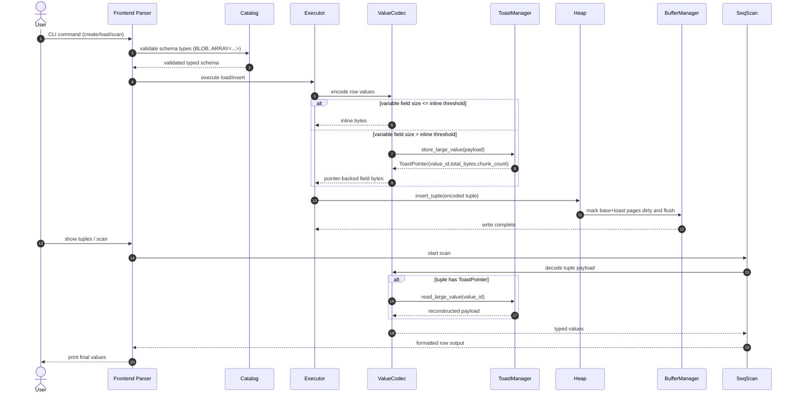

# RookDB Solution Design Report (Submission 2-2)
## Component: BLOB and ARRAY Data Type Support

This report is prepared for the **design phase** of RookDB and follows the required submission format in `Submission-Instructions-2-2.pdf`.

## Scope and Assumptions
- Component scope is limited to backend and CLI changes required to support `BLOB` and `ARRAY` types.
- Existing slotted-page layout is retained as required.
- Existing fixed types (`INT`, `TEXT`, `BOOLEAN`) must continue to work.
- ARRAY support in this phase is **homogeneous arrays** (all elements of one declared type).
- If a BLOB or ARRAY payload is too large for inline tuple storage, it is stored out-of-line in a **TOAST-like side table** (non-chain design).

---

## 1. Database and Architecture Design Changes

### 1.1 Current State (Based on Existing Docs + Code)
- Catalog stores column type as `String` in `src/backend/catalog/types.rs`.
- CSV ingestion and tuple decode logic in `src/backend/executor/load_csv.rs` and `src/backend/executor/seq_scan.rs` are hardcoded for `INT`, `TEXT`, `BOOLEAN`.
- Page format uses slotted pages (`lower`, `upper`, item-id array, tuple region) in `src/backend/page/mod.rs`.
- Tuple bytes currently assume fixed interpretation and do not carry rich type metadata for variable-length values.

### 1.2 Proposed Architecture Extensions

#### A) Catalog Layer Changes
- Replace free-form type strings with a typed representation so `BLOB` and `ARRAY<...>` can be validated and serialized consistently.
- Add schema metadata needed for variable-length semantics.

Proposed column metadata:
```rust
pub enum DataType {
    Int32,
    Boolean,
    Text,
    Blob,
    Array { element_type: Box<DataType> },
}

pub struct Column {
    pub name: String,
    pub data_type: DataType,
    pub nullable: bool,
    pub default_value: Option<Value>,
}
This will help in Compile-time safety, easier validation, and no repeated string matching bugs.
```

#### B) Record Layout Changes
- Keep slotted-page item directory unchanged.
- Redefine tuple payload format to support mixed fixed/variable columns.

Proposed tuple layout inside slot payload:
- `[TupleHeader]`
- `[NullBitmap]`
- `[FixedRegion + VarFieldDirectory]`
- `[VariablePayloadRegion]`

Tuple header fields:
- `column_count: u16`
- `null_bitmap_bytes: u16`
- `var_field_count: u16`
- `flags: u16`

Var-field directory entry (per BLOB/ARRAY/TEXT field):
- `offset: u32`
- `length: u32`
- `flags: u16` (inline vs external TOAST)
- `reserved: u16`

#### C) Page Layout Changes (Still Slotted)
- Keep slotted page contract from docs.
- Maintain `lower` and `upper` pointers.
- Item-id remains `(tuple_offset, tuple_length)`.
- Optional enhancement for fragmentation tracking can be added in reserved header bytes, but base design remains fully slotted.

#### D) TOAST-like Storage for Large Variable-Length Values (Non-Chain)
- Introduce a side relation per base table (example: `employees__toast.dat`) for out-of-line variable-length values.
- Base tuple stores a compact pointer (`ToastPointer`) instead of linking page-by-page chains.
- Large values are split into chunks and inserted as independent TOAST rows identified by `value_id` + `chunk_no`.

Base tuple pointer format:
- `value_id: u64`
- `total_bytes: u32`
- `chunk_count: u32`

TOAST chunk row format:
- `value_id: u64`
- `chunk_no: u32`
- `chunk_len: u16`
- `flags: u16` (compression/encryption reserved)
- `chunk_data: [u8; variable up to chunk limit]`

TOAST table metadata format:
- `next_value_id: u64`
- `toast_page_count: u32`
- `reserved: u32`

#### E) Buffer Manager Integration
- BLOB and ARRAY read/write paths require pinning base table pages plus TOAST table pages.
- Dirty-page tracking must include both base relation and TOAST relation writes.
- Fetch path should support batched TOAST chunk reads by `(value_id, chunk_no)` to avoid random page thrashing.

#### F) Performance and Scalability Justification
- **Scalability:** TOAST-style out-of-line storage prevents large BLOBs from exhausting page-local free space and allows values larger than one page.
- **Performance:** small values remain inline to reduce extra I/O; large values pay TOAST lookup cost only when required.
- **Data volume handling:** chunk rows in a TOAST relation scale to arbitrarily large payloads without long pointer traversal chains.
- **Maintainability:** typed schema model avoids string-based type handling scattered across parser/executor.


### 1.3 Dependency Assumptions
- ARRAY requires parser support for `ARRAY<type>` declaration and input literals.
- BLOB requires binary input strategy (`@file_path` or `0x...`) and TOAST manager support.
- Existing CLI flow and page API remain base dependencies.

---

## 2. Backend Data Structures

### 2.1 Data Structures to be Created

#### 2.1.1 `DataType` and `Value` (`src/backend/catalog/data_type.rs`)
**Pseudo structure:**
```rust
#[derive(Serialize, Deserialize, Clone, Debug, PartialEq)]
pub enum DataType {
    Int32,
    Boolean,
    Text,
    Blob,
    Array { element_type: Box<DataType> },
}

#[derive(Clone, Debug, PartialEq)]
pub enum Value {
    Null,
    Int32(i32),
    Boolean(bool),
    Text(String),
    Blob(Vec<u8>),
    Array(Vec<Value>),
}
```
**Purpose:** canonical type/value model for fixed + variable-length data.
**Justification:**
- Strong type safety for schema validation, parser behavior, and executor branching.
- Eliminates duplicated string comparisons (`"BLOB"`, `"ARRAY<INT>"`) across modules.
- Enables recursive/nested type representation (`Array { element_type: ... }`) that cannot be safely represented with flat strings.
- Improves error reporting precision (`expected ARRAY<INT>, found ARRAY<TEXT>`).

#### 2.1.2 `VarFieldEntry` and `TupleHeader` (`src/backend/storage/row_layout.rs`)
**Pseudo structure:**
```rust
pub struct TupleHeader {
    pub column_count: u16,
    pub null_bitmap_bytes: u16,
    pub var_field_count: u16,
    pub flags: u16,
}

pub struct VarFieldEntry {
    pub offset: u32,
    pub length: u32,
    pub flags: u16,
    pub reserved: u16,
}
```
**Purpose:** tuple-level metadata for mixed fixed/variable column decoding.
**Justification:**
- Supports deterministic decode of variable-length values without schema-specific hardcoded cursor logic.
- Makes tuple format extensible (new flags and field metadata can be added without breaking slot layout).
- Separates logical column order from physical payload placement, allowing compaction and optional inline/out-of-line placement.

#### 2.1.3 `ToastPointer`, `ToastChunk`, and `ToastManager` (`src/backend/storage/toast.rs`)
**Pseudo structure:**
```rust
pub struct ToastPointer {
    pub value_id: u64,
    pub total_bytes: u32,
    pub chunk_count: u32,
}

pub struct ToastChunk {
    pub value_id: u64,
    pub chunk_no: u32,
    pub chunk_len: u16,
    pub flags: u16,
    pub data: Vec<u8>,
}

pub struct ToastManager {
    // dependency handles (disk/buffer)
    pub next_value_id: u64,
}
```
**Purpose:** store and retrieve out-of-line BLOB/ARRAY payloads in a TOAST-like side table.
**Justification:**
- Non-chain lookup by `value_id` + `chunk_no` avoids long pointer traversal and chain corruption cascades.
- Chunk rows are easier to vacuum/delete (`DELETE WHERE value_id=?`) than linked overflow pages.
- Keeps base table page density higher because only compact pointers are stored inline.
- Aligns with production DBMS design patterns (TOAST-like separation for very large attributes).

#### 2.1.4 `ValueCodec` (`src/backend/storage/value_codec.rs`)
**Pseudo structure:**
```rust
pub struct ValueCodec;

impl ValueCodec {
    pub fn encode(value: &Value, ty: &DataType) -> Result<Vec<u8>>;
    pub fn decode(bytes: &[u8], ty: &DataType) -> Result<Value>;
    pub fn encode_array(values: &[Value], elem_ty: &DataType) -> Result<Vec<u8>>;
    pub fn decode_array(bytes: &[u8], elem_ty: &DataType) -> Result<Vec<Value>>;
}
```
**Purpose:** single encoding/decoding path used by insert/load/scan/update.
**Justification:**
- Single source of truth for BLOB/ARRAY binary format reduces incompatibility bugs.
- Guarantees symmetric round-trip behavior between write path and scan path.
- Simplifies testing because all serialization logic is unit-testable in one module.

### 2.2 Data Structures to be Modified

#### 2.2.1 `Column` (`src/backend/catalog/types.rs`)
**Updated structure:**
```rust
pub struct Column {
    pub name: String,
    pub data_type: DataType,        // changed from String
    pub nullable: bool,             // new
    pub default_value: Option<Value>, // new
}
```
**Purpose of modification:** represent BLOB and ARRAY schema exactly and support null/default semantics.
**Justification:**
- Allows strict schema enforcement before any bytes are written.
- Enables null/default semantics directly in metadata rather than ad-hoc in executor code.
- Prevents invalid schema strings from silently entering the catalog.

#### 2.2.2 `Catalog/Table` metadata (`src/backend/catalog/types.rs`)
**Updated structure:**
```rust
pub struct Table {
    pub columns: Vec<Column>,
    pub schema_version: u32, // new
}
```
**Purpose of modification:** schema evolution and compatibility during migration.
**Justification:**
- Required to migrate old `String` type catalogs without data loss.
- Enables future changes (e.g., collation, compression flags) with explicit compatibility boundaries.

#### 2.2.3 `BufferManager` page state (`src/backend/buffer_manager/buffer_manager.rs`)
**Updated structure (conceptual):**
```rust
pub struct BufferFrame {
    pub page: Page,
    pub dirty: bool,
    pub pin_count: u32,
}
```
**Purpose of modification:** safe update flow for base-table and TOAST-table pages.
**Justification:**
- Multi-page and multi-relation writes must not lose dirty-state metadata.
- Pin-count isolation prevents premature eviction while a value spans several chunk operations.

### 2.3 Detailed Data Structure Decision Justification

| Data Structure | Why Needed | Why  |
|---|---|---|
| `DataType` | Schema definition for BLOB/ARRAY and validation hooks | Enum shape enforces legal types at compile time; string shape cannot safely model recursive array element typing. |
| `Value` | Runtime container for parsed and decoded values | Typed variants keep executor logic explicit and avoid unsafe byte interpretation in multiple places. |
| `TupleHeader` | Tuple-level decode contract | Fixed header gives predictable parser entrypoint and supports format versioning. |
| `VarFieldEntry` | Location metadata for variable attributes | Explicit offset/length decouples logical field order from byte placement; improves extensibility. |
| `ToastPointer` | Indirection from base row to out-of-line data | Compact fixed-size pointer preserves base-page density and stable row layout. |
| `ToastChunk` | Chunked storage unit for large values | `(value_id, chunk_no)` key enables deterministic reconstruction and selective repair/cleanup. |
| `ToastManager` | Encapsulated API for TOAST read/write/delete | Prevents TOAST logic leakage into executor and heap layers; improves testability. |
| `BufferFrame` | Concurrency-safe page lifecycle metadata | Dirty/pin metadata is mandatory when one logical row operation touches multiple physical pages. |

---

## 3. Backend Functions

### 3.1 Functions to be Created

#### 3.1.1 `parse_data_type`
- Function name: `parse_data_type`
- Description: parse type declarations like `BLOB`, `ARRAY<INT>` into `DataType`.
- Inputs: `type_text: &str`
- Outputs: `Result<DataType>`
- Detailed steps:
1. Normalize whitespace/case.
2. Match primitive types (`INT`, `BOOLEAN`, `TEXT`, `BLOB`).
3. If `ARRAY<...>`, recursively parse inner type.
4. Reject unsupported nesting patterns with clear error.

#### 3.1.2 `ValueCodec::encode`
- Function name: `encode`
- Description: convert typed `Value` to storage bytes.
- Inputs: `value: &Value`, `ty: &DataType`
- Outputs: `Result<Vec<u8>>`
- Detailed steps:
1. Validate value/type compatibility.
2. Encode fixed types directly.
3. For `Blob`, prefix with length.
4. For `Array`, call `encode_array`.
5. Return encoded payload.

#### 3.1.3 `ValueCodec::decode`
- Function name: `decode`
- Description: reconstruct typed value from bytes.
- Inputs: `bytes: &[u8]`, `ty: &DataType`
- Outputs: `Result<Value>`
- Detailed steps:
1. Branch by `DataType`.
2. Read length prefixes for variable values.
3. For array values, iterate element entries.
4. Return typed value.

#### 3.1.4 `ToastManager::store_large_value`
- Function name: `store_large_value`
- Description: write large payload into TOAST side-table as ordered chunk rows.
- Inputs: `toast_file: &mut File`, `payload: &[u8]`
- Outputs: `Result<ToastPointer>`
- Detailed steps:
1. Allocate a new `value_id` from TOAST metadata.
2. Split payload into fixed chunk sizes.
3. Insert each chunk as a TOAST tuple with `(value_id, chunk_no, chunk_len, data)`.
4. Return `ToastPointer { value_id, total_bytes, chunk_count }`.

#### 3.1.5 `ToastManager::read_large_value`
- Function name: `read_large_value`
- Description: reconstruct payload from TOAST chunks using `value_id`.
- Inputs: `toast_file: &mut File`, `ptr: &ToastPointer`
- Outputs: `Result<Vec<u8>>`
- Detailed steps:
1. Fetch all chunk rows for `value_id`.
2. Sort/validate by `chunk_no`.
3. Concatenate chunk bytes in order.
4. Validate `total_bytes` and return payload.

#### 3.1.6 `encode_tuple_v2`
- Function name: `encode_tuple_v2`
- Description: build new tuple format with tuple header + var-field directory.
- Inputs: `values: &[Value]`, `schema: &[Column]`
- Outputs: `Result<Vec<u8>>`
- Detailed steps:
1. Build null bitmap.
2. Encode each column.
3. Decide inline vs TOAST pointer for each variable field.
4. Build directory and payload region.
5. Emit full tuple bytes.

#### 3.1.7 `decode_tuple_v2`
- Function name: `decode_tuple_v2`
- Description: read tuple bytes into typed values.
- Inputs: `tuple_bytes: &[u8]`, `schema: &[Column]`
- Outputs: `Result<Vec<Value>>`
- Detailed steps:
1. Parse tuple header and null bitmap.
2. Read fixed region values.
3. Resolve each var-field entry (inline or TOAST pointer).
4. Decode using `ValueCodec`.
5. Return row values.

### 3.2 Functions to be Modified

#### 3.2.1 `load_catalog` (`src/backend/catalog/catalog.rs`)
- Updated functionality: detect legacy string types and migrate to typed schema format.
- Reason: backward compatibility for existing catalog JSON.
- Updated I/O: same output (`Catalog`) but with migration path.
- Updated steps:
1. Parse JSON.
2. If old schema version, transform column type strings to `DataType`.
3. Fill default nullable/default fields.
4. Return upgraded in-memory catalog.

#### 3.2.2 `create_table` (`src/backend/catalog/catalog.rs`)
- Updated functionality: validate/parse `BLOB` and `ARRAY<...>` definitions.
- Reason: schema correctness before table creation.
- Updated inputs: columns include typed metadata (`DataType`, nullability, defaults).
- Updated steps:
1. Validate each column type.
2. Reject unsupported array element types.
3. Save validated schema in catalog.
4. Create physical table file as before.

#### 3.2.3 `insert_tuple` (`src/backend/heap/mod.rs`)
- Updated functionality: accept tuple bytes produced by new tuple encoder, including TOAST pointers.
- Reason: slotted page insertion must support variable-length tuple payloads.
- Updated I/O: same table file + bytes, but bytes now structured format.
- Updated steps:
1. Compute required space.
2. Allocate new page if needed.
3. Insert encoded tuple and slot entry.
4. Persist page updates.

#### 3.2.4 `load_csv` and `load_csv_into_pages` (`src/backend/executor/load_csv.rs`, `src/backend/buffer_manager/buffer_manager.rs`)
- Updated functionality: parse BLOB and ARRAY values from CSV/CLI.
- Reason: current loaders only support `INT`, `TEXT`, `BOOLEAN`.
- Updated inputs: typed schema, BLOB tokens, ARRAY literals, TOAST threshold policy.
- Updated steps:
1. Parse raw field token by type.
2. For BLOB: resolve `@path` or `0x` hex.
3. For ARRAY: parse bracket syntax and element values.
4. Encode tuple with `encode_tuple_v2` and TOAST out-of-line placement if threshold is exceeded.
5. Insert into pages.

#### 3.2.5 `show_tuples` (`src/backend/executor/seq_scan.rs`)
- Updated functionality: decode and print BLOB/ARRAY values.
- Reason: current tuple scan assumes fixed field lengths.
- Updated outputs: printable summary for BLOB (length + preview), literal rendering for ARRAY.
- Updated steps:
1. Read slot tuple bytes.
2. Decode tuple using schema.
3. If TOAST pointer is present, fetch chunks from TOAST table and reconstruct payload.
4. Render each value safely.

---

## 4. Frontend Changes (CLI Inputs)

### 4.1 New/Updated CLI Options
- Update table schema input in `create_table` command to accept:
  - `photo:BLOB`
  - `scores:ARRAY<INT>`
  - `tags:ARRAY<TEXT>`
- Extend data loading input so users can provide BLOB and ARRAY values.

### 4.2 User Inputs Required
- Table creation:
  - `column_name:data_type[:nullable][:default]`
- Row/CVS loading:
  - BLOB field as one of:
    - `@/absolute/or/relative/path.bin`
    - `0xA1B2C3...` (hex)
  - ARRAY field as one of:
    - `[1,2,3]`
    - `["a","b","c"]`

### 4.3 Expected Input Format
- Data type grammar:
  - `INT | BOOLEAN | TEXT | BLOB | ARRAY<INT> | ARRAY<BOOLEAN> | ARRAY<TEXT>`
- ARRAY literals must be bracketed and comma-separated.
- CSV escape handling keeps commas inside quoted strings valid.

---

## 5. Overall Component Workflow (End-to-End View)

### 5.1 High-Level Execution Flow

Image link: `sequence_diagram-1.png`


### 5.2 Sequence Diagram (TOAST Handling)


### 5.3 Step-by-Step End-to-End
1. User creates table with `BLOB` and/or `ARRAY<...>` columns.
2. CLI parser validates declared types and calls catalog APIs.
3. Catalog persists typed schema in `catalog.json`.
4. On data load/insert, executor parses each input field into `Value`.
5. `ValueCodec` encodes each value; large payloads are written into TOAST chunk rows.
6. Row encoder builds tuple bytes with var-field directory.
7. Heap layer inserts tuple into slotted page and updates slot directory.
8. Buffer manager flushes modified base and TOAST pages.
9. On query/display, scan reads slot payload, decodes tuple, and fetches TOAST payload if pointer flag is set.
10. CLI displays ARRAY literal and BLOB metadata (size, optional preview/hash).

---

## 6. Codebase Structure Changes

### 6.1 New Files to be Created
- `src/backend/catalog/data_type.rs`
- `src/backend/storage/mod.rs`
- `src/backend/storage/value_codec.rs`
- `src/backend/storage/toast.rs`
- `src/backend/storage/row_layout.rs`
- `src/backend/storage/tuple_codec.rs`

### 6.2 Existing Files to be Modified
- `src/backend/catalog/types.rs`
- `src/backend/catalog/catalog.rs`
- `src/backend/heap/mod.rs`
- `src/backend/buffer_manager/buffer_manager.rs`
- `src/backend/executor/load_csv.rs`
- `src/backend/executor/seq_scan.rs`
- `src/frontend/table_cmd.rs`
- `src/frontend/data_cmd.rs`
- `src/backend/mod.rs`
- `src/lib.rs`

### 6.3 New Modules/Folders
- Add `storage` module under `src/backend/` for encoding, tuple layout, and TOAST logic.

---

## 7. Test Cases

### 7.1 What Will Be Tested
- Type parsing and schema validation for `BLOB` and `ARRAY<...>`.
- Encoding/decoding round-trip correctness.
- Inline and TOAST out-of-line storage behavior.
- Null handling in variable-length columns.
- Tuple insertion and scan decode with mixed fixed/variable schemas.
- Backward compatibility with old catalog type format.

### 7.2 Testing Approach

#### A) Unit Tests
- `parse_data_type("BLOB")` returns `DataType::Blob`.
- `parse_data_type("ARRAY<INT>")` returns expected nested type.
- `ValueCodec::encode/decode` round trip for:
  - empty BLOB
  - binary BLOB with null bytes
  - simple int array
  - text array
- TOAST pointer serialization/deserialization.

#### B) Integration Tests
- Create DB + table with `BLOB` and `ARRAY<INT>` columns.
- Load rows where:
  - BLOB fits inline.
  - BLOB requires TOAST.
  - ARRAY fits inline.
  - ARRAY requires TOAST.
- Run tuple scan and verify output values exactly.

#### C) Negative Tests
- Invalid type declarations (`ARRAY<>`, `ARRAY<BLOB>` if unsupported in phase).
- Malformed ARRAY literals (`[1,,2]`, missing brackets).
- Invalid BLOB token (bad hex, missing file path).
- Missing TOAST chunks or invalid chunk ordering.

#### D) Performance/Stress Tests
- Bulk load many rows with medium BLOB payloads.
- Insert few rows with very large BLOB payloads.
- Measure base-page growth, TOAST chunk counts, and decode latency.

### 7.3 Example Concrete Test Matrix
- `TC01`: Create table with `file_data:BLOB` -> catalog stores typed schema.
- `TC02`: Insert BLOB `0xDEADBEEF` -> read back exact bytes.
- `TC03`: Insert 64KB BLOB -> TOAST chunks created and recoverable.
- `TC04`: Insert `ARRAY<INT>` `[10,20,30]` -> round trip preserved.
- `TC05`: Insert `ARRAY<TEXT>` `["a","bb"]` -> round trip preserved.
- `TC06`: Mixed row (`INT`, `BLOB`, `ARRAY<INT>`) -> scan decode correct.
- `TC07`: Legacy catalog load -> migration succeeds, no metadata loss.

---

## Final Justification Summary
The proposed design keeps RookDB aligned with its existing slotted-page architecture while introducing the minimum required extensions to support `BLOB` and `ARRAY` robustly. The design is appropriate because it:
- preserves compatibility with current storage primitives,
- scales to large payloads through TOAST-like out-of-line chunk storage,
- centralizes serialization/deserialization logic,
- and provides a clear implementation path with testable module boundaries.
