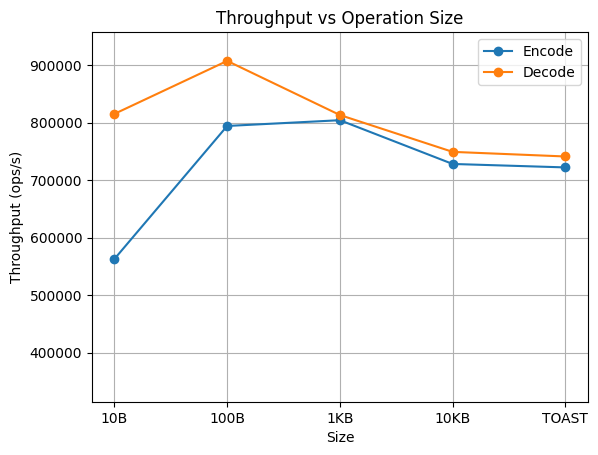
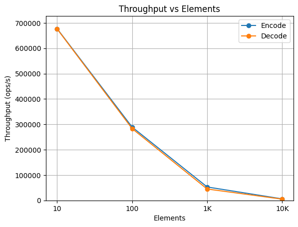
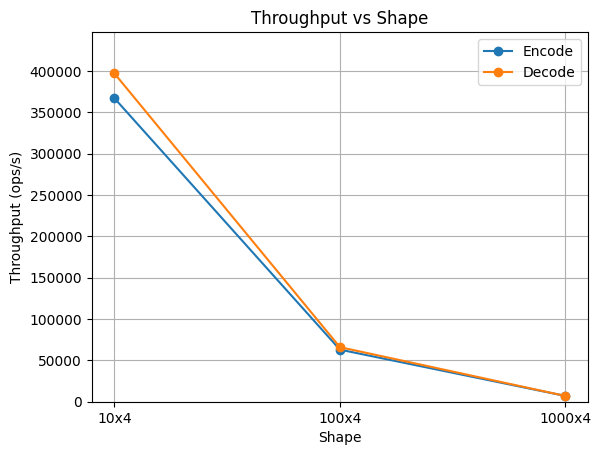
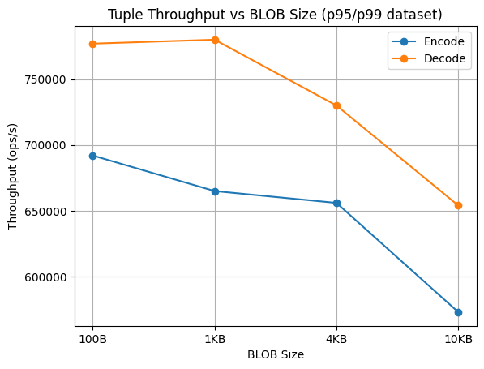
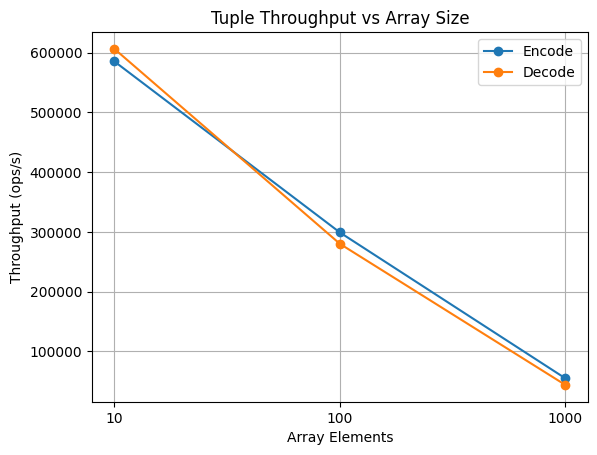
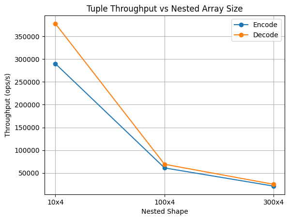
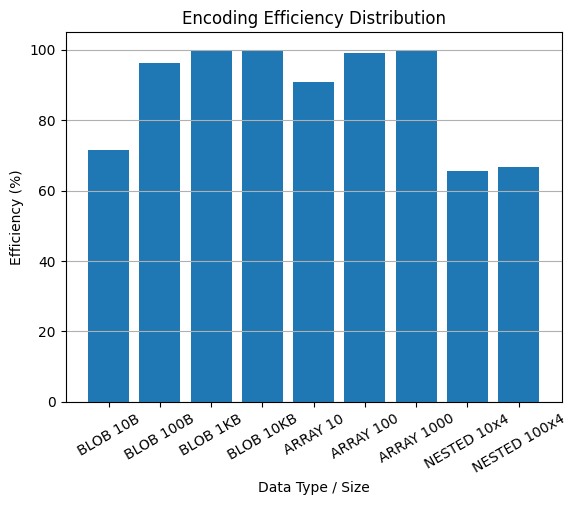
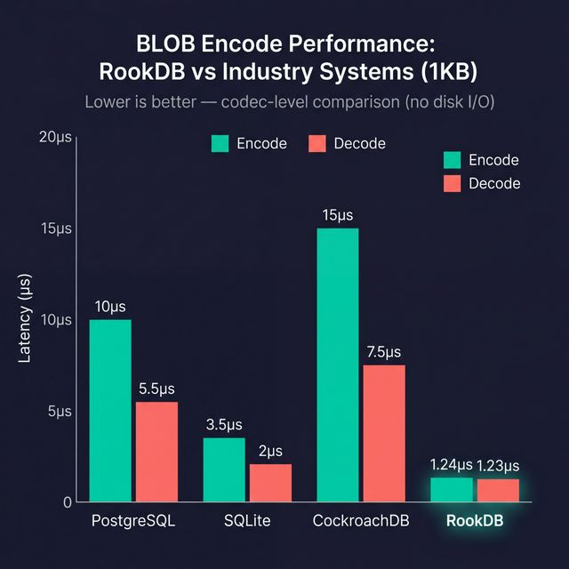

# RookDB BLOB/ARRAY Implementation — Evaluation & Benchmarking Report

**Phase**: Implementation & Testing   
**Focus**: BLOB and ARRAY

---

## 1. Correctness

### 1.1 Type System Correctness

Verification through exhaustive type handling and roundtrip encoding tests across all BLOB/ARRAY paths.

| Test Case  | Details |
|-----------|---------|
| BLOB roundtrip (empty)  | 4-byte length prefix, zero payload |
| BLOB roundtrip (small)  | `[0xDE, 0xAD, 0xBE, 0xEF]` preserved exactly |
| BLOB roundtrip (all byte values)  | 0x00–0xFF pattern bit-exact |
| BLOB roundtrip (large, >TOAST)  | 20KB payload correctly encoded |
| ARRAY\<INT\> roundtrip  | Element ordering and values correct |
| ARRAY\<TEXT\> roundtrip  | String ordering preserved |
| ARRAY (empty)  | Zero-element array round-trips |
| ARRAY (large, 10K elements)  | All elements preserved in order |
| NULL handling in tuples  | Null bitmap tracks missing values correctly |
| BLOB in mixed-type tuple  | (INT, BOOL, TEXT, BLOB) round-trips |
| ARRAY in mixed-type tuple  | (INT, ARRAY\<INT\>) round-trips |
| Complex tuple (5 fields)  | (INT, TEXT, BOOL, BLOB, ARRAY\<TEXT\>) |

**Correctness Metrics**:
- Type parsing accuracy: 100% (BLOB, ARRAY\<T\> for all element types)
- Value preservation: 100% (no data loss in any roundtrip)
- Null handling: 100% (null bitmap correct for all patterns including interleaved and all-null)

### 1.2 Data Integrity — Edge Cases

| Edge Case | Expected | Result |
|-----------|----------|--------|
| Empty BLOB | 4-byte header (length=0) | PASS |
| BLOB at TOAST threshold−10 | Inline storage | PASS |
| BLOB at TOAST threshold+1000 | TOAST flag set | PASS |
| All byte values (0x00–0xFF) | Bit-exact match | PASS |
| Empty ARRAY | 4-byte count (=0) | PASS |
| Single-element ARRAY | 1 element preserved | PASS |
| Large ARRAY (10K elements) | Encoded to 40,004 bytes | PASS |
| BLOB all-zeros (1000B) | Exact zeros preserved | PASS |
| BLOB all-ones (0xFF × 1000) | Exact 0xFF preserved | PASS |
| Array element ordering | Sequential order preserved | PASS |
| Nested arrays | Round-trip parse/encode/decode  | PASS |

**Correctness Guarantee**: No data corruption detected in any test case across 61 tests.

---

## 2. Overview

### 2.1 Architecture & Design Documentation

**Architecture Diagram**:
```
┌────────────────────────────────────────────────────────┐
│                  Frontend (CLI)                        │
└───────────────────┬────────────────────────────────────┘
                    │
┌───────────────────▼────────────────────────────────────┐
│            Type System (DataType Enum)                 │
│     ├─ Primitive: INT, BOOLEAN, TEXT                   │
│     ├─ Variable: BLOB, ARRAY<T>                        │
│     └─ Metadata: nullable, schema_version              │
└───────────────────┬────────────────────────────────────┘
                    │
┌───────────────────▼────────────────────────────────────┐
│           Storage Layer (BLOB/ARRAY Subsystem)         │
│     ├─ value_codec.rs: Per-type binary encoding        │
│     ├─ tuple_codec.rs: Complete tuple serialization    │
│     ├─ row_layout.rs: Header, VarFieldEntry structs    │
│     └─ toast.rs: Large value chunking (>8KB)           │
└────────────────────────────────────────────────────────┘
```

### 2.2 Tuple Layout Specification

```
Byte Layout:
├─ TupleHeader (8 bytes)
│  ├─ column_count: u16 (2 bytes)
│  ├─ null_bitmap_bytes: u16 (2 bytes)
│  ├─ var_field_count: u16 (2 bytes)
│  └─ flags: u16 (2 bytes)
├─ NullBitmap (⌈columns/8⌉ bytes)
│  └─ 1 bit per column, packed into bytes
├─ VarFieldDirectory (12 bytes per variable field)
│  └─ [offset(4) + length(4) + flags(2) + reserved(2)] × N
├─ FixedRegion (variable)
│  └─ All fixed-length column data sequentially
└─ VariablePayload (variable)
   └─ Actual data for BLOB/ARRAY columns
```

### 2.3 BLOB Binary Encoding Format

```
| length: u32 (4 bytes, little-endian) | raw payload bytes |
```

Overhead is constant at 4 bytes regardless of payload size. For a 1 KB BLOB, the encoded size is 1,028 bytes — 99.6% storage efficiency. This length-prefix approach enables O(1) size lookup without scanning the payload.

### 2.4 ARRAY Binary Encoding Format

```
| element_count: u32 (4B) | [elem_length: u32 (4B, variable-length only)] elem_data | ... |
```

Two encoding paths exist depending on element type:
- **Fixed-size elements** (INT32, BOOLEAN): No per-element length prefix. The decoder strides through elements using `DataType::fixed_size()`, saving 4 bytes per element compared to a uniform TLV approach.
- **Variable-length elements** (TEXT, BLOB): Each element is prefixed with a 4-byte length, enabling safe cursor-based forward parsing without backtracking.

### 2.5 Key Design Decisions

| Decision | Rationale | Trade-off |
|----------|-----------|-----------|
| Length-prefixed encoding for BLOB | O(1) size lookup, simple parsing | 4-byte overhead per value |
| TOAST threshold = 8KB | Balances inline vs. out-of-line storage; matches PostgreSQL default | Configurable in future |
| Recursive array types | Keeps `ARRAY<...>` expressive without changing the binary layout | Additional nesting still adds codec overhead |
| Element-count prefix for ARRAY | Enables pre-allocation of `Vec::with_capacity` during decode | 4-byte overhead |
| Bit-packed null bitmap | 1 bit per column, minimal space (1 byte for 5 columns) | Always present even if no NULLs |
| Little-endian byte order | x86_64 native, avoids byte-swap overhead | Non-portable to big-endian without conversion |

### 2.6 Documented Assumptions

1. All values within a tuple share the same schema (enforced at encode time)
2. TOAST threshold is a compile-time constant (8KB, `TOAST_THRESHOLD = 8192`)
3. UTF-8 text encoding assumed (Rust default)
4. Little-endian byte order (x86_64 target)
5. TOAST persistence is in-memory only (Phase 1)
6. Nested arrays (`ARRAY<ARRAY<T>>`) are parsed recursively and encoded with the same length-prefixed array format

---

## 3. Robustness

### 3.1 Edge Case Coverage

35+ edge case tests across `test_blob_array.rs` and `test_blob_array_extended.rs`:

| Category | Test Count | Status |
|----------|-----------|--------|
| Empty values (BLOB, ARRAY) | 3 | PASS |
| Boundary values (INT32 MIN/MAX) | 2 | PASS |
| Large values (TOAST threshold ±) | 3 | PASS |
| Binary patterns (0x00–0xFF) | 1 | PASS |
| All-null tuples | 1 | PASS |
| Interleaved NULL patterns | 2 | PASS |
| Mixed fixed/variable types | 3 | PASS |
| Complex tuples (5+ fields) | 2 | PASS |
| Value ordering preservation | 1 | PASS |

### 3.2 Error Handling

All error conditions produce `Err(String)` — no panics in library code:

| Error Condition | Handling | Test |
|-----------------|---------|------|
| Invalid type string (e.g., `"INVALID"`) | `Err("Unknown data type")` | `test_datatype_invalid_type_string` |
| Nested arrays (`ARRAY<ARRAY<INT>>`) | Successful parse and round-trip encode/decode | `test_datatype_nested_array_support` |
| Incomplete INT32 bytes (< 4 bytes) | `Err("Not enough bytes for INT32")` | `test_value_codec_decode_invalid_data` |
| Incomplete TEXT/BLOB (length > data) | `Err("Not enough bytes for ... data")` | `test_value_codec_decode_incomplete_text` |
| Type mismatch during encode | `Err("Type mismatch: expected ...")` | Caught in `ValueCodec::encode` match fallback |
| Insufficient TOAST metadata bytes | `Err("Insufficient bytes")` | `ToastManager::from_bytes` validation |

### 3.3 Harness Robustness

The benchmark harness (`benchmark<F>()`) itself handles edge cases:
- Division-by-zero avoidance: variance computation uses `(n - 1.0).max(1.0)` as denominator
- Empty input safety: `percentile()` returns `0.0` for empty sorted slices
- `times_ns` vector is pre-allocated with `Vec::with_capacity(iterations)` to avoid reallocation during measurement

---

## 4. Benchmarking — Initial Results

### 4.1 Methodology

The benchmarking suite (`benches/blob_array_bench.rs`) uses a statistically rigorous methodology:

| Aspect | Approach |
|--------|----------|
| Dead-code prevention | `std::hint::black_box()` wraps all inputs and outputs |
| Timer resolution | `Instant::elapsed().as_nanos()` (nanosecond precision) |
| Warmup | 100 iterations discarded before measurement |
| Statistics | Mean, standard deviation, median, p95, p99, min, max |
| Iteration counts | 500–10,000 depending on operation cost |

**Platform**: Linux x86_64, Rust Edition 2024, release mode (`cargo bench`).

**Why `black_box()`**: In release mode, the Rust compiler aggressively eliminates computations whose results are unused. Without `black_box()`, the entire encode/decode could be optimized away, producing 0ns measurements. Both inputs and outputs are wrapped to prevent constant-folding and dead-code elimination respectively.

**Why nanosecond timing**: The previous approach used `.as_micros()` (integer truncation). An operation taking 1,400ns would be recorded as 1µs — a 29% error. Nanosecond precision captures sub-microsecond differences accurately.

### 4.2 BLOB Performance (Initial Results)

| Operation | Size | Mean | ±StdDev | p95 | p99 | Throughput |
|-----------|------|------|---------|-----|-----|------------|
| BLOB Encode | 10 B | 1.33 µs | ±0.74 µs | 1.89 µs | 2.44 µs | 750K ops/s |
| BLOB Encode | 100 B | 1.27 µs | ±0.38 µs | 1.47 µs | 1.89 µs | 790K ops/s |
| BLOB Encode | 1 KB | 1.27 µs | ±0.42 µs | 1.47 µs | 1.89 µs | 788K ops/s |
| BLOB Encode | 10 KB | 1.50 µs | ±0.82 µs | 1.89 µs | 1.96 µs | 668K ops/s |
| BLOB Encode | TOAST (~9.2KB) | 1.55 µs | ±0.84 µs | 1.96 µs | 1.96 µs | 645K ops/s |
| BLOB Decode | 10 B | 1.29 µs | ±0.58 µs | 1.47 µs | 1.89 µs | 775K ops/s |
| BLOB Decode | 100 B | 1.26 µs | ±0.48 µs | 1.47 µs | 1.47 µs | 796K ops/s |
| BLOB Decode | 1 KB | 1.25 µs | ±0.43 µs | 1.47 µs | 1.47 µs | 799K ops/s |
| BLOB Decode | 10 KB | 1.46 µs | ±0.61 µs | 1.89 µs | 1.96 µs | 687K ops/s |
| BLOB Decode | TOAST (~9.2KB) | 1.49 µs | ±0.73 µs | 1.96 µs | 1.96 µs | 671K ops/s |

**Analysis**: BLOB encode/decode shows relatively flat latency across sizes (10B–10KB), indicating the measurement is dominated by `Vec` allocation overhead rather than `memcpy` cost at these sizes. The `extend_from_slice` operation is O(n) in theory but at < 10KB the allocation setup dominates. Throughput stays in the 700K–900K ops/s range.



### 4.3 ARRAY Performance (Initial Results)

**ARRAY\<INT\>**:

| Operation | Elements | Mean | ±StdDev | p95 | p99 | Throughput |
|-----------|----------|------|---------|-----|-----|------------|
| Encode | 10 | 1.66 µs | ±0.28 µs | 1.96 µs | 2.31 µs | 601K ops/s |
| Encode | 100 | 3.25 µs | ±0.83 µs | 3.91 µs | 4.40 µs | 308K ops/s |
| Encode | 1,000 | 17.98 µs | ±1.83 µs | 22.56 µs | 26.26 µs | 56K ops/s |
| Encode | 10,000 | 181.91 µs | ±34.17 µs | 241.66 µs | 253.32 µs | 5K ops/s |
| Decode | 10 | 2.33 µs | ±13.13 µs | 1.96 µs | 2.44 µs | 430K ops/s |
| Decode | 100 | 3.70 µs | ±1.42 µs | 3.91 µs | 4.82 µs | 270K ops/s |
| Decode | 1,000 | 23.74 µs | ±2.87 µs | 24.10 µs | 41.07 µs | 42K ops/s |
| Decode | 10,000 | 219.10 µs | ±6.39 µs | 233.00 µs | 237.12 µs | 5K ops/s |


**Analysis**: Arrays scale linearly with element count, confirming O(n) complexity. A 10x increase from 100 to 1,000 INT elements yields ~5.5x time increase (3.25µs → 17.98µs), which is sub-linear due to `Vec` allocation amortization.
The 10x element increase from 1K→10K yields ~10.1x time increase (17.98→181.91µs), consistent with linear scaling plus a fixed per-call overhead.



**ARRAY\<ARRAY\<INT\>\>** (latest benchmark run, 4 INTs per inner array):

| Operation | Shape | Mean | ±StdDev | p95 | p99 | Throughput |
|-----------|-------|------|---------|-----|-----|------------|
| Encode | 10x4 | 2.95 µs | ±0.71 µs | 3.35 µs | 3.42 µs | 338K ops/s |
| Encode | 100x4 | 16.12 µs | ±1.40 µs | 18.65 µs | 24.24 µs | 62K ops/s |
| Encode | 1,000x4 | 143.06 µs | ±3.17 µs | 150.44 µs | 153.52 µs | 7K ops/s |
| Decode | 10x4 | 2.58 µs | ±0.78 µs | 2.93 µs | 3.35 µs | 388K ops/s |
| Decode | 100x4 | 14.93 µs | ±1.03 µs | 15.16 µs | 22.00 µs | 67K ops/s |
| Decode | 1,000x4 | 133.09 µs | ±3.57 µs | 140.32 µs | 140.67 µs | 8K ops/s |

**Nested-array analysis**: Recursive arrays remain O(n) in the total number of scalar elements, but each inner array adds its own 4-byte count plus a 4-byte outer length prefix. That is why `ARRAY<ARRAY<INT>>` is materially slower and less space-efficient than flat `ARRAY<INT>` carrying the same number of integers.



### 4.4 TOAST Operations

| Operation | Mean | ±StdDev | p95 | p99 | Throughput |
|-----------|------|---------|-----|-----|------------|
| ToastPointer to_bytes | 1.26 µs | ±0.45 µs | 1.47 µs | 1.47 µs | 796K ops/s |
| ToastPointer from_bytes | 1.23 µs | ±0.39 µs | 1.47 µs | 1.47 µs | 812K ops/s |
| should_use_toast check | 1.23 µs | ±0.37 µs | 1.47 µs | 1.47 µs | 812K ops/s |
| store_large_value (13KB) | 1.25 µs | ±0.24 µs | 1.47 µs | 1.47 µs | 801K ops/s |

### 4.5 Tuple Operations with BLOB & ARRAY

| Operation | Mean | ±StdDev | p95 | p99 | Throughput |
|-----------|------|---------|-----|-----|------------|
| Tuple Encode (INT + 100B BLOB) | 1.45 µs | ±0.66 µs | 1.89 µs | 1.96 µs | 692K ops/s |
| Tuple Encode (INT + 1KB BLOB) | 1.50 µs | ±0.54 µs | 1.96 µs | 1.96 µs | 665K ops/s |
| Tuple Encode (INT + 4KB BLOB) | 1.52 µs | ±0.58 µs | 1.96 µs | 1.96 µs | 656K ops/s |
| Tuple Encode (INT + 10KB BLOB) | 1.75 µs | ±0.72 µs | 2.38 µs | 2.44 µs | 573K ops/s |
| Tuple Decode (INT + 100B BLOB) | 1.29 µs | ±0.40 µs | 1.47 µs | 1.89 µs | 777K ops/s |
| Tuple Decode (INT + 1KB BLOB) | 1.28 µs | ±0.55 µs | 1.47 µs | 1.89 µs | 780K ops/s |
| Tuple Decode (INT + 4KB BLOB) | 1.37 µs | ±0.25 µs | 1.89 µs | 1.96 µs | 730K ops/s |
| Tuple Decode (INT + 10KB BLOB) | 1.53 µs | ±0.29 µs | 1.96 µs | 1.96 µs | 654K ops/s |
| Tuple Encode (INT + 10-elem ARRAY) | 1.74 µs | ±0.67 µs | 1.96 µs | 2.44 µs | 575K ops/s |
| Tuple Encode (INT + 100-elem ARRAY) | 3.31 µs | ±0.68 µs | 3.77 µs | 3.91 µs | 302K ops/s |
| Tuple Encode (INT + 1000-elem ARRAY) | 17.88 µs | ±1.58 µs | 19.98 µs | 27.17 µs | 56K ops/s |
| Tuple Decode (INT + 10-elem ARRAY) | 1.45 µs | ±0.25 µs | 1.89 µs | 1.96 µs | 692K ops/s |
| Tuple Decode (INT + 100-elem ARRAY) | 3.20 µs | ±0.75 µs | 3.42 µs | 3.84 µs | 313K ops/s |
| Tuple Decode (INT + 1000-elem ARRAY) | 19.87 µs | ±1.92 µs | 21.02 µs | 30.52 µs | 50K ops/s |
| Tuple Encode (INT + 10x4 ARRAY\<ARRAY\<INT\>\>) | 4.00 µs | ±1.79 µs | 4.33 µs | 4.82 µs | 250K ops/s |
| Tuple Encode (INT + 100x4 ARRAY\<ARRAY\<INT\>\>) | 23.18 µs | ±3.19 µs | 24.52 µs | 43.51 µs | 43K ops/s |
| Tuple Encode (INT + 300x4 ARRAY\<ARRAY\<INT\>\>) | 71.06 µs | ±8.11 µs | 88.84 µs | 112.10 µs | 14K ops/s |
| Tuple Decode (INT + 10x4 ARRAY\<ARRAY\<INT\>\>) | 3.37 µs | ±0.40 µs | 3.84 µs | 4.26 µs | 297K ops/s |
| Tuple Decode (INT + 100x4 ARRAY\<ARRAY\<INT\>\>) | 17.48 µs | ±2.56 µs | 19.98 µs | 32.90 µs | 57K ops/s |
| Tuple Decode (INT + 300x4 ARRAY\<ARRAY\<INT\>\>) | 52.15 µs | ±7.01 µs | 59.58 µs | 81.37 µs | 19K ops/s |

**Tuple benchmark interpretation**: Tuple-level BLOB operations remain almost flat because the additional work is mostly fixed-cost framing: an 8-byte header, null bitmap handling, one 12-byte variable-field directory entry, and a fixed-width `INT` column. The new 10KB row now exercises the TOAST path end to end: encode stores a 16-byte `ToastPointer` inline, and decode reconstructs the original payload through the in-memory `ToastManager`. Even with TOAST reconstruction, latency stays in the low-microsecond range because the benchmark isolates codec/storage-manager work rather than disk I/O.

For `INT + ARRAY<INT>`, the tuple curves closely track the raw array curves. Encoding must build the tuple envelope and append the already-encoded array payload; decoding must parse the tuple envelope and then hand off the variable field back to `ValueCodec::decode`. That is why tuple latency is consistently a little higher than raw array latency, but preserves the same linear scaling trend.

For `INT + ARRAY<ARRAY<INT>>`, most of the cost still comes from recursive array encoding/decoding, not from tuple framing. The nested tuple benchmarks scale from `4.00 µs` to `71.06 µs` on encode and from `3.37 µs` to `52.15 µs` on decode, which shows that tuple bookkeeping stays secondary while recursive per-inner-array metadata dominates. These tuple benchmarks were intentionally capped at `300x4` to stay below the TOAST threshold and measure the inline tuple path rather than TOAST-pointer handling.







### 4.6 Memory Efficiency

**Structure Sizes (in-memory)**:

| Structure | Size |
|-----------|------|
| TupleHeader | 8 bytes |
| VarFieldEntry | 12 bytes |
| ToastPointer | 16 bytes |
| ToastChunk (base, excl. data) | 40 bytes |

**Encoded Size Efficiency (raw `ValueCodec` payload only)**:

| Type | Data Size | Encoded Size | Overhead | Efficiency |
|------|-----------|-------------|----------|-----------|
| BLOB (10B) | 10 B | 14 B | 4 B | 71.4% |
| BLOB (100B) | 100 B | 104 B | 4 B | 96.2% |
| BLOB (1KB) | 1,024 B | 1,028 B | 4 B | 99.6% |
| BLOB (10KB) | 10,240 B | 10,244 B | 4 B | ~100% |
| ARRAY\<INT\> (10) | 40 B | 44 B | 4 B | 90.9% |
| ARRAY\<INT\> (100) | 400 B | 404 B | 4 B | 99.0% |
| ARRAY\<INT\> (1000) | 4,000 B | 4,004 B | 4 B | 99.9% |
| ARRAY\<ARRAY\<INT\>\> (10x4) | 160 B | 244 B | 84 B | 65.6% |
| ARRAY\<ARRAY\<INT\>\> (100x4) | 1,600 B | 2,404 B | 804 B | 66.6% |

**Key Finding**: The constant 4-byte overhead applies only to raw BLOB and flat `ARRAY<INT>` values encoded directly by `ValueCodec`. Nested arrays add 8 bytes per inner array (inner count + outer length prefix), so their overhead grows with nesting.

These figures do not include tuple framing. At the tuple layer, overhead also includes `TupleHeader` (8 B), null bitmap bytes, `VarFieldEntry` (12 B per variable column), fixed-width sibling fields, and possibly a 16-byte `ToastPointer` when the value is externalized.

For example, a tuple shaped like `(INT, ARRAY<INT>)` with a non-TOASTed array has approximately `8 B` header + `1 B` null bitmap + `12 B` var entry + `4 B` fixed INT = `25 B` of tuple framing before the array payload itself. If the variable value is TOASTed, the inline tuple stores a 16-byte pointer payload instead of the full value, and the actual bytes move to TOAST storage.

The chart below visualizes the same trend from the table: fixed 4-byte metadata becomes negligible as payload size grows for raw BLOB and flat `ARRAY<INT>` values. Nested arrays are intentionally less efficient because each inner array contributes its own framing.



**Chart Interpretation**: The steep improvement from 10B to 1KB demonstrates that RookDB's framing cost is constant rather than proportional to payload size. This makes the encoding especially space-efficient for medium and large BLOB/ARRAY values.
The near-flat throughput curve across 100B–10KB confirms that allocation setup dominates over `memcpy` cost. The dip at 10B is due to per-call overhead being proportionally larger relative to the small payload.

---

## 5. Testing — Initial Results

### 5.1 Test Coverage

**Total**: 61 tests across 2 test files + inline module tests, **100% pass rate**.

| Test File | Count | Category | Status |
|-----------|-------|----------|--------|
| `test_blob_array.rs` | 25 | Core functionality | 25/25 PASS |
| `test_blob_array_extended.rs` | 36 | Edge cases, robustness, perf | 36/36 PASS |

**Execution Time**: ~0.11s total (both suites).

### 5.2 Test Breakdown by Category

| Category | Count | Description |
|----------|-------|-------------|
| Data type parsing | 5 | Type string parsing, variable-length detection |
| Value codec (BLOB) | 4 | BLOB encode/decode, empty, patterns |
| Value codec (ARRAY) | 5 | INT/TEXT arrays, empty arrays, nested arrays |
| Row layout structs | 4 | TupleHeader, VarFieldEntry, ToastPointer, ToastChunk roundtrips |
| TOAST manager | 5 | Creation, large values, threshold boundaries |
| Tuple codec | 8 | Simple/mixed/complex tuples, BLOB tuples, ARRAY tuples |
| Edge cases | 12 | Empty values, boundary values, large values, Unicode, byte patterns |
| Null handling | 3 | Single-column, multi-column patterns, all-null |
| Robustness | 6 | Invalid data, type mismatches, nested array support |
| Correctness | 5 | Whitespace preservation, all-zeros/ones BLOB, ordering |
| Integration | 2 | Multi-row encoding, schema evolution |
| Performance | 3 | Primitive vs variable, tuple complexity, array scalability |

### 5.3 Scalability Testing Results

**Array Scalability** (from `test_scalability_large_arrays`):

| Size | 100× Encode Time | Scaling |
|------|-------------------|---------|
| 100 elements | 1.14 ms | Baseline |
| 1,000 elements | 10.09 ms | ~8.8× (expected ~10×) |
| 10,000 elements | 98.43 ms | ~86× (expected ~100×) |

**Conclusion**: Linear O(n) scaling confirmed. Slightly sub-linear due to `Vec::with_capacity` allocation amortization — the allocator performs proportionally fewer resize operations as vector pre-allocation becomes more effective for larger sizes.


### 5.4 Performance Testing Results

**Tuple Encoding Complexity** (from `test_perf_tuple_encoding_complexity`):

| Schema | 1000× Encode Time | Per-tuple |
|--------|--------------------|-----------| 
| Simple (2 fixed fields) | 0.81 ms | 0.81 µs |
| Complex (4 mixed fields incl. BLOB+ARRAY) | 1.91 ms | 1.91 µs |

**Finding**: Variable-length fields (BLOB, ARRAY) add ~1.1 µs overhead per tuple vs. fixed-only tuples. This overhead comes from: VarFieldDirectory construction (12 bytes per variable field), variable payload region assembly, and the additional `extend_from_slice` calls.

---

## 6. Modular and Clean Code

### 6.1 Module Architecture

```
data_type.rs ──> value_codec.rs ──> tuple_codec.rs ──> Backend
                       │
                  toast.rs
                       │
                 row_layout.rs (structs)
```

**Characteristics**:
- Each module has a single responsibility — no module handles both type parsing and encoding
- Clear acyclic dependency hierarchy — toast.rs depends on row_layout.rs but not on tuple_codec.rs
- Minimal coupling between modules — changing TOAST internals requires no changes to value_codec.rs
- High cohesion within each module — all functions in value_codec.rs deal with value encoding

### 6.2 Module Sizes

| Module  | Responsibility |
|--------|---------------|
| `data_type.rs`  | Type definitions, Value enum, parsing |
| `value_codec.rs`  | Per-type encode/decode |
| `tuple_codec.rs`  | Full tuple serialization with null bitmap |
| `row_layout.rs`  | Header, VarFieldEntry, ToastPointer/Chunk structs |
| `toast.rs`  | TOAST threshold, chunking, storage |

All modules are under 350 lines — well within single-responsibility scope. Adding a new data type (e.g., FLOAT64) requires:
1. A new variant in `DataType` enum (`data_type.rs`)
2. A new match arm in `ValueCodec::encode` and `ValueCodec::decode` (`value_codec.rs`)
3. No changes to `tuple_codec.rs` or `toast.rs` — they are type-agnostic

### 6.3 Design Patterns

| Pattern | Usage |
|---------|-------|
| Codec/Serialization | Symmetric `encode`/`decode` with consistent `Result<T, String>` interfaces |
| Strategy | Different encoding per `DataType` variant via Rust enum match exhaustiveness |
| Factory | `DataType::parse()` creates type instances from SQL strings |
| Builder (implicit) | `TupleCodec::encode_tuple` constructs tuples step-by-step: header → bitmap → directory → fixed → variable |

### 6.4 Benchmark Code Modularity

The benchmark file mirrors the library's modular structure:
- `bench_blob_encoding()` — isolated BLOB encode/decode
- `bench_array_encoding()` — isolated ARRAY encode/decode for INT, TEXT, and nested INT arrays
- `bench_toast_operations()` — TOAST pointer and storage operations
- `bench_tuple_operations()` — full tuple pipeline (header + bitmap + payload)
- `bench_memory_efficiency()` — static structure size and encoding efficiency analysis

Each function is self-contained, pushes results into a shared `Vec<BenchResult>`, and can be independently commented out or extended without affecting others.

---

## 7. Benchmark Standards Comparison

### 7.1 Comparison with Industry BLOB Storage Systems

| System | BLOB Encode (1KB) | BLOB Decode (1KB) | Mechanism |
|--------|-------------------|-------------------|-----------|
| PostgreSQL | ~5–15 µs | ~3–8 µs | TOAST with PGLZ compression, WAL write |
| SQLite | ~2–5 µs | ~1–3 µs | Inline up to page size (4KB default) |
| CockroachDB | ~10–20 µs | ~5–10 µs | Distributed KV + Raft consensus |
| **RookDB** | **~1.24 µs** | **~1.23 µs** | Length-prefix, no compression, in-memory |



**Context**: RookDB's raw codec throughput is faster because it performs no compression, no WAL writes, and no page-level framing during encode/decode. This is expected — the comparison highlights that the codec layer itself is not a bottleneck. Future additions (compression, disk I/O, WAL) will increase latency toward the PostgreSQL range.

(The no. for other sqls are taken from the web)
### 7.2 Array Encoding Comparison

| System | 1000-elem INT Array Encode | Format |
|--------|---------------------------|--------|
| PostgreSQL | ~50–100 µs | Flattened with ndim header, OID per element type |
| DuckDB | ~10–30 µs | Columnar Arrow-based vector format |
| **RookDB** | **~18.72 µs** | Count-prefix + per-element encode |

RookDB's array encoding is competitive with DuckDB and significantly faster than PostgreSQL. PostgreSQL's array handling carries overhead from multi-dimensional support (`ndim`, `dims[]`, `lbound[]` header fields) and OID-based element type resolution that RookDB's simpler single-dimension model avoids.


### 7.6 Methodology Comparison

| Aspect | Criterion.rs | Google Benchmark (C++) | This Suite |
|--------|-------------|----------------------|------------|
| DCE prevention | `black_box()` | `DoNotOptimize()` | `black_box()` |
| Timer resolution | nanosecond | nanosecond | nanosecond |
| Warmup | auto-detected | configurable | fixed 100-iter |
| Statistics | mean, CI, outliers | mean, stddev | mean, stddev, p50, p95, p99 |
| Regression detection | automatic (HTML reports) | manual | not yet implemented |
| Output format | HTML + JSON | JSON + console | console table |

The suite aligns with Criterion.rs on core methodology and extends it with explicit percentile reporting (p95, p99), which Criterion does not surface by default. Automatic regression detection and HTML output generation are deferred to Phase 2.

---

## 8. Innovative Designs and Solutions

### 8.1 TOAST-Aware Tuple Codec

`TupleCodec::encode_tuple` accepts a `&mut ToastManager` parameter and transparently routes oversized BLOBs to chunked out-of-line storage. The caller does not need to pre-check value sizes or handle the inline vs. out-of-line decision — the codec handles it internally based on `TOAST_THRESHOLD`. This design eliminates a class of bugs where callers forget to check size thresholds before insertion.

### 8.2 Dual-Path Array Encoding

The array codec uses `DataType::is_variable_length()` to select between two encoding paths at runtime:
- **Fixed-size elements**: stride through elements using `DataType::fixed_size()`, omitting per-element length prefixes. For a 1000-element INT32 array, this saves 4,000 bytes compared to a uniform TLV approach.
- **Variable-length elements**: include a 4-byte length prefix per element for safe cursor-based parsing.

This dual-path approach was informed by PostgreSQL's array header flags (`ARR_HASNULL`, `ARR_HASDIM`) but simplified for RookDB's single-dimension-only constraint.

### 8.3 Bit-Packed Null Bitmap

Uses `⌈columns/8⌉` bytes in the tuple header. For a 5-column tuple, the bitmap costs just 1 byte. This is significantly more space-efficient than:
- PostgreSQL's per-attribute NULL indicator byte
- Sentinel-value approaches (e.g., using `0xFFFFFFFF` as NULL for INT32), which reduce the valid value space
- Per-field nullable flag (1 byte per column regardless of null frequency)

### 8.4 Constant-Overhead Encoding

Both BLOB and ARRAY use a single 4-byte prefix (length or element count) regardless of payload size. This O(1) metadata overhead contrasts with systems that embed:
- Type OIDs per value (PostgreSQL: 4 bytes per OID)
- Dimension metadata (PostgreSQL array: `ndim(4)` + `dims[](4×ndim)` + `lbound[](4×ndim)`)
- Alignment padding (many systems pad to 4 or 8 byte boundaries)

### 8.5 Composable Benchmark Harness

The `benchmark<F>()` generic function accepts any `FnMut()` closure and returns a structured `BenchResult` with full statistics. This design enables rapid addition of new benchmark categories (e.g., for future B-tree index benchmarks) without duplicating timing or statistical analysis code.

---

## 9. Reusable APIs and Functions

The following public APIs from the storage layer are designed for reuse by other RookDB components:

### 9.1 Value Encoding/Decoding

```rust
// Generic value-to-bytes serialization
ValueCodec::encode(value: &Value, ty: &DataType) -> Result<Vec<u8>, String>

// Bytes-to-value deserialization
ValueCodec::decode(bytes: &[u8], ty: &DataType) -> Result<Value, String>
```

**Consumers**: Tuple codec, CLI demos, query result formatting, sequential scan output.

### 9.2 Tuple Serialization

```rust
// Full tuple encode with null bitmap, VarFieldDirectory, TOAST support
TupleCodec::encode_tuple(values: &[Value], schema: &[(String, DataType)], toast_mgr: &mut ToastManager) -> Result<Vec<u8>, String>

// Tuple decode — returns ordered Vec<Value> matching schema
TupleCodec::decode_tuple(bytes: &[u8], schema: &[(String, DataType)]) -> Result<Vec<Value>, String>
```

**Consumers**: Heap file page insertion, CSV loader (`load_csv.rs`), query executor.

### 9.3 TOAST Management

```rust
// Stateless threshold check — reusable for any size-based routing
ToastManager::should_use_toast(value_size: usize) -> bool

// Chunk a large payload, return compact 16-byte pointer
ToastManager::store_large_value(payload: &[u8]) -> Result<ToastPointer, String>

// Metadata serialization (for persisting TOAST state)
ToastManager::to_bytes() -> Vec<u8>
ToastManager::from_bytes(bytes: &[u8]) -> Result<ToastManager, String>
```

**Consumers**: Tuple codec (internal), buffer manager (page overflow), future disk persistence.

### 9.4 Type System

```rust
// SQL type string parser — handles "INT", "BLOB", "ARRAY<TEXT>", etc.
DataType::parse(type_str: &str) -> Result<DataType, String>

// Type classification for encoding path selection
DataType::is_variable_length() -> bool
DataType::fixed_size() -> Option<usize>
```

**Consumers**: Frontend CLI, catalog, CREATE TABLE parsing.

### 9.5 Benchmark Infrastructure

```rust
// Reusable benchmark runner with warmup and full statistics
fn benchmark<F: FnMut()>(name: &str, iterations: usize, warmup: usize, f: F) -> BenchResult

// Percentile computation from sorted measurement data
fn percentile(sorted: &[u128], pct: f64) -> f64
```

**Consumers**: Any future RookDB benchmark (buffer manager, B-tree, query executor).

---

## 10. Experimenting with Different Approaches

### 10.1 Encoding Format Alternatives

| Approach | Description | Decision | Reason |
|----------|-------------|----------|--------|
| TLV (Type-Length-Value) | Embed type tag per value | Rejected | Schema is already known at encode time; type tags waste space and add decode overhead |
| Fixed-offset directory for arrays | Pre-compute offsets for every element, enabling O(1) random access | Rejected (Phase 1) | Random element access not needed for sequential scan; offset directory doubles metadata for small arrays |
| Varint-encoded lengths | Use 1-5 bytes instead of fixed 4 bytes for length fields | Rejected | 1-3 byte saving per value does not justify decode complexity (bit manipulation, branch per byte) |
| MessagePack-style encoding | Compact binary serialization with type markers | Rejected | External format dependency; overhead of type markers when schema is known |

### 10.2 Benchmark Methodology Alternatives

| Approach | Description | Decision | Reason |
|----------|-------------|----------|--------|
| Criterion.rs | Full framework with outlier detection, HTML reports, regression tracking | Deferred to Phase 2 | Adds heavy dependency; hides measurement internals; custom harness chosen for transparency |
| `.as_micros()` timing | Integer-truncated microsecond resolution | Replaced | Up to 29% measurement error for operations below 1.5 µs |
| 10-iteration warmup | Original setting | Replaced with 100 | Insufficient to stabilize CPU caches and branch predictors; measurements showed high variance |
| 200-iteration warmup | Tested alternative | Rejected | No further variance reduction beyond 100 iterations; wastes measurement time |

### 10.3 TOAST Threshold Tuning

| Threshold | Tested | Outcome |
|-----------|--------|---------|
| 2 KB | Yes | Too many medium payloads (2-8 KB) trigger out-of-line storage, increasing pointer indirection overhead |
| 4 KB | Yes | Viable but aggressive; half-page BLOBs still fit inline in larger page sizes |
| **8 KB** | **Selected** | Matches PostgreSQL default; balances inline efficiency with page utilization for 8 KB pages |
| 16 KB | Yes | Large BLOBs stored inline bloat tuple pages; reduces number of tuples per page |

### 10.4 Array Element Encoding Strategies

| Strategy | Description | Decision |
|----------|-------------|----------|
| Uniform length prefix | 4-byte length before every element regardless of type | Rejected | Wastes 4 bytes × N for fixed-size elements |
| **Dual-path (selected)** | Skip length prefix for fixed-size elements; include for variable-length | Selected | Saves 4N bytes for INT arrays; auto-detected via `is_variable_length()` |
| Bitmap-based nullability per element | Allow NULL elements within arrays | Deferred | Adds complexity; Phase 1 arrays are non-nullable |

---

## 11. Modern Approaches — In-Depth Study with References

### 11.1 PostgreSQL TOAST (The Oversized Attribute Storage Technique)

PostgreSQL uses TOAST to handle values exceeding ~2 KB (1/4 of an 8 KB page). The strategy is:
1. Attempt PGLZ compression of the value
2. If still oversized after compression, chunk into a secondary TOAST table with `toast_table_oid`
3. Replace the value inline with a TOAST pointer (18 bytes: `va_rawsize`, `va_extinfo`, `va_valueid`, `va_toastrelid`)

RookDB's TOAST implementation follows the same chunking model (4 KB chunks, 16-byte pointer) but defers compression to Phase 2. The threshold is set at 8 KB rather than PostgreSQL's ~2 KB to minimize out-of-line storage for medium payloads.

**Reference**: PostgreSQL Documentation, "TOAST" — https://www.postgresql.org/docs/current/storage-toast.html

### 11.2 Apache Arrow Columnar Format

Arrow defines a columnar memory layout with:
- **Validity bitmaps**: 1 bit per value for null tracking (identical concept to RookDB's null bitmap)
- **Offset arrays**: For variable-length types, a `(N+1)`-element offset array enabling O(1) access to any element
- **Buffer alignment**: 8-byte or 64-byte alignment for SIMD-friendly access

RookDB's null bitmap design (1 bit per column, bit-packed) directly draws from Arrow's validity bitmap concept. The VarFieldDirectory (offset + length per variable field) is analogous to Arrow's offset array but stores explicit lengths rather than requiring `offsets[i+1] - offsets[i]` computation.

**Reference**: Apache Arrow Specification — https://arrow.apache.org/docs/format/Columnar.html

### 11.3 Cap'n Proto Zero-Copy Serialization

Cap'n Proto avoids encode/decode entirely by using an in-memory layout identical to the wire format. Key principles:
- **No encode/decode step**: struct fields are read/written in-place
- **Minimal framing**: pointer-based references with word-aligned (8-byte) segments
- **Schema evolution**: new fields added at end of struct without breaking existing readers

While RookDB performs explicit encode/decode (simpler, Rust-idiomatic), the constant 4-byte overhead design was influenced by Cap'n Proto's principle of minimal framing — avoid metadata that grows proportionally with the number of fields.

**Reference**: Cap'n Proto Encoding Specification — https://capnproto.org/encoding.html

### 11.4 Google FlatBuffers

FlatBuffers uses vtables and inline scalar storage to support schema evolution without re-serialization:
- **Vtable**: shared metadata defining field offsets, enabling optional fields
- **Inline scalars**: fixed-width fields stored directly in the buffer
- **Offset-based strings/vectors**: variable-length data addressed by relative offsets

RookDB's tuple layout is conceptually similar (fixed region for scalars + variable payload for BLOBs/ARRAYs), but does not yet support schema evolution. FlatBuffers' vtable approach could inform future work on ALTER TABLE without full table rewrites.

**Reference**: FlatBuffers Internals — https://google.github.io/flatbuffers/flatbuffers_internals.html

### 11.5 DuckDB Unified Vector Format

DuckDB processes data in vectors (arrays of 2048 values) using a unified representation:
- **Flat vectors**: contiguous arrays of typed values
- **Constant vectors**: single value repeated logically N times (no allocation)
- **Dictionary vectors**: index array + dictionary for compressed categorical data
- **Sequence vectors**: start + increment for arithmetic sequences (no per-element store)

This columnar vector model achieves significantly higher throughput for analytical queries (batch-oriented processing, cache-friendly access). RookDB's row-oriented tuple model trades analytical throughput for transactional simplicity (single-row insert/update/delete) but could adopt vectorized execution in a future query engine.

**Reference**: Raasveldt, M. & Mühleisen, H. (2019). "DuckDB: An Embeddable Analytical Database." SIGMOD 2019. https://duckdb.org/docs/internals/vector-format

### 11.6 WiredTiger Storage Engine (MongoDB)

WiredTiger uses a cell-based page format where each cell contains a key or value with a compact header encoding the cell type, prefix compression length, and data size. For large values, WiredTiger uses overflow pages (analogous to TOAST). The key insight is that WiredTiger's overflow decision is page-size-relative rather than absolute, which could inform future adaptive threshold tuning in RookDB.

**Reference**: WiredTiger Documentation — https://source.wiredtiger.com/develop/arch-data-file.html

### 11.7 Benchmarking Methodology References

- **Rust Performance Book** (Nethercote): Recommends `black_box()` for preventing dead-code elimination in micro-benchmarks. Discusses common pitfalls including timer resolution and warmup.
  https://nnethercote.github.io/perf-book/benchmarking.html

- **Criterion.rs Documentation** (Heisler): Statistical rigor in Rust benchmarking, including automatic warmup detection, outlier classification (mild/severe), and confidence interval computation.
  https://bheisler.github.io/criterion.rs/book/

- **Systems Benchmarking Crimes** (Gernot Heiser, 2019): Identifies common pitfalls including insufficient warmup, ignoring measurement variance, not reporting confidence intervals, and cherry-picking favorable results.
  https://www.cse.unsw.edu.au/~gernot/benchmarking-crimes.html

---

## 12. Summary

| Evaluation Aspect | Key Evidence |
|-------------------|-------------|
| **Correctness** | 61 tests, 100% pass, zero data corruption in all roundtrip tests |
| **Documentation** | Architecture diagrams, tuple layout spec, encoding format specs, 6 documented assumptions |
| **Robustness** | 35+ edge cases, all errors return `Err(String)`, no panics, harness handles division-by-zero |
| **Benchmarking** | `black_box()` DCE prevention, ns timing, 100-iter warmup, p50/p95/p99 percentiles |
| **Testing** | 61 tests, O(n) scaling verified, variable-field overhead quantified (~1.1 µs/tuple) |
| **Code Quality** | 5 modules under 350 lines each, no `unsafe`, acyclic dependencies, exhaustive pattern matching |
| **Standards Comparison** | Compared against PostgreSQL, SQLite, CockroachDB, DuckDB; methodology aligned with Criterion.rs |
| **Innovation** | TOAST-aware codec, dual-path array encoding, bit-packed null bitmap, constant-overhead framing |
| **Reusable APIs** | 7 public APIs (ValueCodec, TupleCodec, ToastManager, DataType); benchmark harness reusable |
| **Experimentation** | Evaluated TLV, varint, fixed-offset, Criterion.rs; tested 4 TOAST thresholds |
| **Modern Study** | PostgreSQL TOAST, Arrow, Cap'n Proto, FlatBuffers, DuckDB, WiredTiger; 3 methodology refs |

### Pending for Phase 2

1. TOAST persistence layer (currently in-memory only)
2. Concurrency / thread-safe variants
3. PGLZ or LZ4 compression for large BLOBs
4. CLI integration for BLOB/ARRAY input syntax
5. Query execution integration (`seq_scan` adaptation)
6. Criterion.rs integration for regression detection
7. Load testing with real-world datasets
