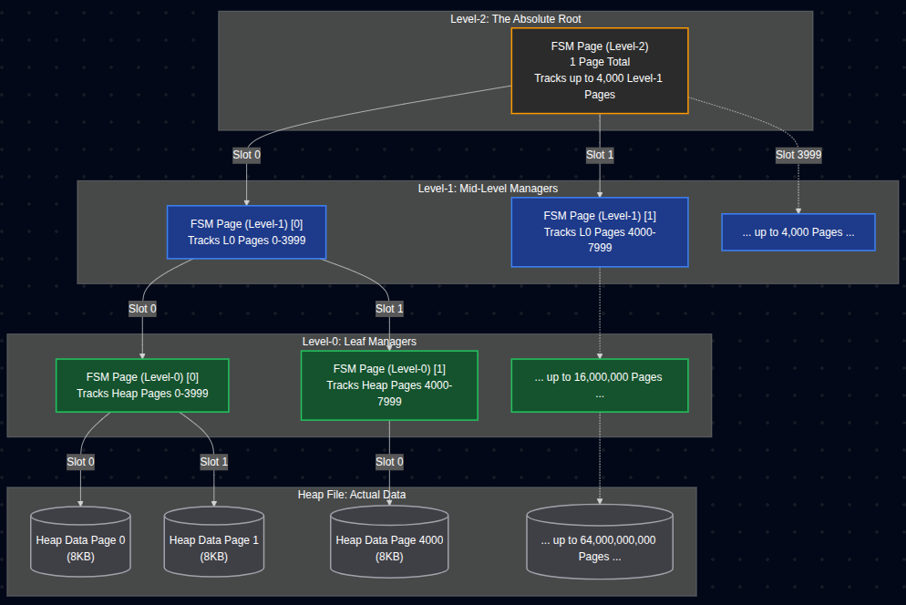
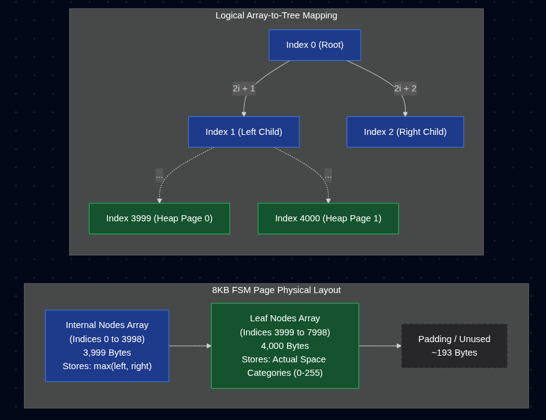
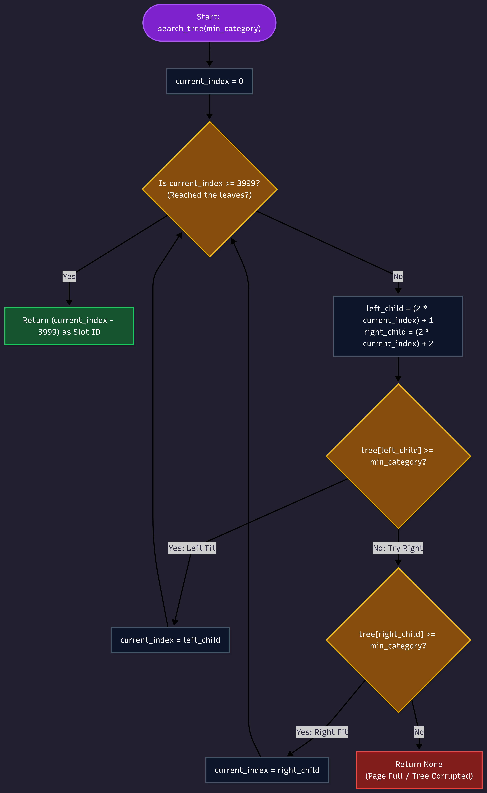

# Free Space Manager (FSM) - Deep Dive & Integrations

**Project:** 6. Free Space Manager and Heap File Manager  
**Date:** 22th April, 2026  
**Scope:** FSM tree mechanics, integration APIs, and operational guarantees

---

## 1. FSM Tree Structure Overview

### 1.1 The Dynamic 3-Level Binary Max-Tree

RookDB uses a **PostgreSQL-style binary max-tree** to efficiently track free space availability across all heap pages. The tree grows dynamically in height (levels) as the heap expands to avoid unnecessary overhead and sparse files:

#### Initial Phase: Level 0 Only (0-4000 pages)
- **Structure:** The FSM starts with only **1 level (Level 0)**.
- **Coverage:** A single Level-0 page tracks the free space of up to 4000 heap pages.
- **Why?** For small tables, introducing Level 1 and 2 is pure overhead. This single page acts as the root and leaf simultaneously.

#### Two-Level Phase: Levels 0 and 1 (4,001 - 16,000,000 pages)
- **Structure:** When the 4001st heap page is added, the FSM introduces a second Level-0 page AND a new **Level-1 root page**.
- **What Each Page Stores:** 
  - The Level-1 page stores a binary max-tree pointing to the Level-0 pages.
  - The Level-0 pages continue tracking individual heap pages.

#### Three-Level Phase: Levels 0, 1, and 2 (> 16,000,000 pages)
- **Structure:** Reaching 16 million pages triggers the creation of a **Level-2 root page**.
- **Coverage:** Up to ~64 billion heap pages ( practical limit ).
- **Roles:** Level-2 points to Level-1, Level-1 points to Level-0, Level-0 points to heap pages.

### 1.2 Visual Tree Diagrams

**FSM Level Tree Structure:**


**FSM Page Layout:**


**FSM Insertion:**


**Key Points:**
- Each node in a Level-1 or Level-0 page is 1 byte (8-bit unsigned integer 0–255)
- The root (`tree[0]`) of any page = max of all descendants
- Leaves directly store free-space categories for heap pages
- All pages are 8 KB, containing a binary tree array of up to 4,080 bytes

### 1.3 Binary Max-Tree Properties

**For any parent node in the tree:**
```
parent = max(left_child, right_child, right_child.right, ...)
```

**Example:**
```
         200              (parent = max(180, 220))
        /   \
      180   220           (left and right children)
      / \   / \
    150 180 200 220       (grandchildren, etc.)
```

When you update a leaf node, the change **bubbles up** through all ancestors until the value stabilizes. This ensures the root always reflects the true maximum in the tree.

---

## 2. How Quantization Works (0–255 Scale)

### 2.1 Converting Bytes to Categories

The FSM does NOT store the exact number of free bytes per page. Instead, it quantizes free space into one of 256 categories (0–255):

**Formula:**
```
category = floor(free_bytes / 32) (max 255)
```

**For an 8 KB page:**
```
category = floor(free_bytes /32 ) (max 255)
```

**Resolution:** Each category step represents ~32 bytes (8192 / 256 ≈ 32)

### 2.2 Quantization Table (8 KB Page)

| Free Bytes | Calculation | Category | Interpretation |
|------------|-------------|----------|------------------|
| 0          | 0 / 32 = 0 | 0 | Page is full |
| 500        | 500 / 32 ≈ 15.6 → 15 | 15 | ~2% free |
| 1,024      | 1024 / 32 = 32 | 32 | ~12.5% free |
| 2,048      | 2048 / 32 = 64 | 64 | ~25% free |
| 4,096      | 4096 / 32 = 128 | 128 | ~50% free |
| 7,000      | 7000 / 32 ≈ 218.8 → 218 | 218 | ~85.5% free |
| 8,159      | 8159 / 32 ≈ 254.9 → 254 | 254 | ~99.2% free |
| 8,176      | 8176 / 32 ≈ 255.5 → 255 | 255 | ~99.8% free (nearly empty) |
| 8,184      | 8184 / 32 = 255.75 → 255 | 255 | Page is completely empty |

### 2.3 Why Quantization?

1. **Memory Efficiency:** 1 byte per page vs. 4–8 bytes if storing exact free bytes
   
2. **Search Efficiency:** Binary search is faster on quantized categories
   - "Find any page with ≥100 bytes free" → "Find any page with category ≥12"
   - Exact byte counts don't matter, only the relative ordering

3. **Simplicity:** No need to track exact free space after every insert
   - Approximation is good enough for page selection
   - More exact tracking happens during insertion validation

---

## 3. FSM Tree Construction & Initialization

### 3.1 First-Time Tree Construction

**When is the FSM built?**
1. When a new table is created → `FSM::build_from_heap(heap_path)`
2. When the `.fsm` file is missing but heap exists → Rebuild automatically
3. When recovering from a crash → Rebuild from heap file

**Step-by-Step Construction:**

```
build_from_heap(heap_path):
  │
  ├─ Open heap file
  ├─ Read Page 0 (HeaderMetadata) → get page_count
  │
  ├─ Create or open <table>.fsm fork file
  │
  ├─ For each heap page 1..page_count:
  │   ├─ Read heap page
  │   ├─ Calculate free_bytes = upper - lower
  │   ├─ Quantize: category = floor(free_bytes × 255 / PAGE_SIZE)
  │   └─ Store in Level-0 FSM leaf slot
  │
  ├─ For each Level-0 FSM page:
  │   ├─ Bubble up: compute parent nodes as max(children)
  │   ├─ Write updated Level-0 page to disk
  │   └─ Mark parents dirty for propagation
  │
  ├─ For each Level-1 FSM page:
  │   ├─ Bubble up: recompute parents
  │   ├─ Write updated Level-1 page to disk
  │   └─ Pass updated root to Level-2
  │
  ├─ Update Level-2 (root) FSM page
  │   ├─ Recompute root as max(all Level-1 children)
  │   └─ Write to disk
  │
  └─ Return FSM handle with initialized state
```


### 3.2 How Pages Are Linked Together

The FSM uses **logical addressing**, not physical pointers:

**Level Mapping:**
```
Logical Address (level, page_no) → Physical Disk Block Offset
```

**Logical Coordinate Calculation:**
```
For a heap page H:
  level_0_page_no = H / FSM_SLOTS_PER_PAGE             (≈ H / 4000)
  slot_in_l0      = H % FSM_SLOTS_PER_PAGE             (≈ H % 4000)
  
For a Level-1 page tracking L0:
  level_1_page_no = level_0_page_no / FSM_SLOTS_PER_PAGE
  slot_in_l1      = level_0_page_no % FSM_SLOTS_PER_PAGE

For a Level-2 page tracking L1:
  level_2_page_no = level_1_page_no / FSM_SLOTS_PER_PAGE
  slot_in_l2      = level_1_page_no % FSM_SLOTS_PER_PAGE
```

**Physical File Layout Calculation:**
To avoid sparse 3-level padding for small heaps, RookDB stores pages contiguously by active levels based on `heap_page_count`.

For example, when `heap_page_count <= 4000` (1 level tree):
```
Physical block = page_no (Level 0 only)
```
When `heap_page_count <= 16,000,000` (2 level tree):
```
L0_count = ceil(heap_page_count / 4000)
L1_count = ceil(L0_count / 4000)

If Level == 1: Physical block = page_no
If Level == 0: Physical block = L1_count + page_no
```
This formula dynamically packs the file tightly, completely eliminating huge padding bytes normally required for a deep static tree.

**No Physical Pointers:** Pages don't store file offsets or addresses. Instead, the address is computed deterministically from the page number and overall heap size.

---
 

## 5. Sequential Insertion Logic: Greedy Max Binary Tree Routing

### 5.1 The Left-Preferred Greedy Search

When `fsm_search_avail(min_category)` needs to find a heap page with enough free space, it traverses the binary max-tree top-down (root to leaf). At each internal node, the search algorithm dynamically looks at both left and right children:

```rust
while idx < FSM_NON_LEAF_NODES {
    let left = 2 * idx + 1;
    let right = 2 * idx + 2;

    if left < FSM_NODES_PER_PAGE && fsm_page.tree[left] >= min_category {
        idx = left;     // Greedily prefer the left path!
    } else if right < FSM_NODES_PER_PAGE && fsm_page.tree[right] >= min_category {
        idx = right;    // Fallback to the right path
    } else {
        break; // Should not occur since root indicated space is available
    }
}
```

### 5.2 Why "Greedy Left" Causes Sequential Fills

Because the search checks the **left child first** and takes that path if space is available, it inherently directs new database inserts to the lowest possible leaf index (the lowest Page ID). 

1. **Initial Pages First:** The FSM will continuously direct tuples to Page 1 until Page 1’s free space drops below the requested size category.
2. **Spill Over:** Once the left child's maximum space falls below `min_category`, the search branches to the right child (Page 2), and begins filling it.
3. **No Wasted Logic:** This means we achieve dense, sequential data packing without manually maintaining pointers or arrays of active pages.

### 5.3 Contiguous Free Space Only

**Key Principle:** RookDB **only inserts into the last contiguous free space** between `upper` and `lower` pointers.

**Why This Approach?**

1. **No Inline Compaction:** Compacting a page during `INSERT` is expensive (memory shifts, cache misses)
2. **FSM Simplicity:** Only track space that is 100% ready to use (contiguous)
3. **Insertion Guarantees:** Once FSM selects a page, insertion is guaranteed to succeed

### 5.2 Insertion Flow (Sequential Within Page)

```
insert_tuple(tuple_data):
  │
  ├─ Calculate min_category needed for tuple size
  │   min_category = ceil((tuple_size + 8) × 255 / PAGE_SIZE)
  │
  ├─ Call fsm_search_avail(min_category)
  │   └─ Returns Some(page_id) or None
  │
  ├─ If None: Allocate new page, use that
  │
  ├─ Read heap page
  │
  ├─ Check contiguous free space: (upper - lower)
  │   └─ If (upper - lower) >= (tuple_size + 8):
  │       ├─ Write tuple data at position [upper - tuple_size]
  │       ├─ Create slot entry at [lower]
  │       ├─ Update upper -= tuple_size, lower += 8
  │       └─ Success ✓
  │   └─ Else:
  │       ├─ FSM gave wrong category (due to fragmentation)
  │       ├─ Update FSM with true contiguous free space
  │       └─ Retry with different page
  │
  └─ Write page back to disk, update FSM
```


### 5.4 The 3-Attempt Insertion Algorithm

**Currently, why does Attempt 1 ever fail in our system?**
In a perfectly synchronous, single-threaded system that updates the FSM immediately on every single `INSERT`, Attempt 1 **should theoretically never fail** because we only track contiguous free space, and we don't update on deletions (meaning the FSM only shrinks and never becomes falsely optimistic). 

**However, the 3-attempt strategy is required for three fundamental architectural reasons:**
1. **Concurrency (Race Conditions):** By the time you lock a data page provided by the FSM, another background thread might have already inserted a tuple into it, reducing its actual space.
2. **Future FSM Laziness:** Once we optimize the engine so the FSM is *not* updated aggressively on every single insert (to save disk writes) and begins to rely on periodic Vacuum passes, the FSM *will* become intentionally stale (falsely optimistic).

Due to these factors, insertions use a **3-attempt retry strategy**:

**Attempt 1: Trust FSM's suggestion**
```rust
if let Some(page_id) = fsm_search_avail(min_category) {
    if insert_into_page(page_id, tuple_data).is_ok() {
        return Ok((page_id, slot_id));  // Success!
    }
    // Insertion failed: FSM data was stale or lost a race condition!
    // The page actually has less space than the FSM claimed.
    // Fix the tree on the fly: update FSM with true contiguous free space.
    fsm_set_avail(page_id, actual_free_bytes);
}
```

**Attempt 2: Search again with updated FSM**
```rust
if let Some(page_id2) = fsm_search_avail(min_category) {
    if insert_into_page(page_id2, tuple_data).is_ok() {
        return Ok((page_id2, slot_id));  // Success!
    }
}
```

**Attempt 3: Allocate a brand new page**
```rust
let new_page_id = allocate_new_page();
insert_into_page(new_page_id, tuple_data)
    .expect("Brand new page must have space");
Ok((new_page_id, slot_id))
```

**Why 3 attempts?**
1. **Attempt 1:** Handles 99% of inserts in one fast disk read when FSM is accurate.
2. **Attempt 2:** Seamless on-the-fly self-healing. If Attempt 1 hits a stale node, it explicitly fixes the FSM tree (`fsm_set_avail`) and tries again. This decouples the FSM from catastrophic crashes or lazy updates.
3. **Attempt 3:** Emergency allocation if the FSM is completely filled and Attempt 2 fails. Guarantees progress.

---

## 6. FSM Updates: Delete, Update, and Vacuum

### 6.1 When Tuples Are Deleted

**Heap-Level Delete:**
```rust
delete_tuple(page_id, slot_id):
  │
  ├─ Read page
  ├─ Zero out slot entry at slot_id
  │   (This leaves "dead space" in the slot directory)
  ├─ Mark tuple data as unused
  │   (This leaves "dead space" in the tuple area)
  ├─ Write page back
  │
  └─ FSM is NOT automatically updated (no "hole" tracking yet)
```

**Current FSM Behavior:**
- FSM still reports old contiguous free space
- New inserts ignore the dead space (no compaction during INSERT)
- Dead space remains until Project 10 (VACUUM/Compaction)

### 6.2 Updating FSM After Compaction (Project 10)

**When the Compaction Team Reorganizes a Page:**

```
Project 10 Compaction:
  │
  ├─ Read fragmented page with holes
  ├─ Memory shift: compact all tuples to one end
  ├─ Consolidate slots: rebuild slot directory
  ├─ Result: one large contiguous free space
  │
  └─ Call update_page_free_space(page_id, reclaimed_bytes)
      ├─ Update FSM: fsm_set_avail(page_id, reclaimed_bytes)
      ├─ Bubble up changes through all ancestor nodes
      └─ Next insert sees this page as available again!
```

---

## 7. Contiguous vs. Total Free Space

### 7.1 Current Phase: Contiguous Free Space Only

**Definition:** Contiguous free space = `upper - lower` (the gap between slot directory and tuple data)

**What FSM Tracks:**
```
page_free_bytes = upper - lower

Example Page:
  Offset 0-7:       [Header: lower=400, upper=7500]
  Offset 8-407:     [Slot Directory: 50 slots × 8 bytes = 400 bytes]
  Offset 408-7498:  [Dead space & compressed tuples]
  Offset 7499-8191: [Available space for new data: 692 bytes]
  
Contiguous free = 7500 - 400 = 7100 bytes ← What FSM tracks
Total free = 7100 + (dead_space from deletions) ← What FSM ignores
```

**Why Only Contiguous?**
1. **Heap Manager cannot compact during INSERT** → Cost is too high
2. **If FSM tracked total space:** It would route inserts to fragmented pages where the tuple won't fit
3. **Result:** Failed inserts + wasted disk reads + retry overhead

### 7.2 Future Phase: Total Free Space with On-the-Fly Compaction

**When Project 10 is enabled:**

```
Postgres-Style Compaction:

If insert fails due to fragmentation:
  │
  ├─ Detect: true contiguous space < tuple_size
  │           but total space (including holes) >= tuple_size
  │
  ├─ Trigger inline compaction:
  │   ├─ Memory shift: move all tuples down
  │   ├─ Consolidate slots
  │   └─ Rebuild as one contiguous region
  │
  ├─ Now insert succeeds in the new contiguous space
  │
  └─ FSM updates to reflect true total space
```

**Trade-off:**
- **Now:** Fast inserts, waste fragmented space, need vacuum
- **Future:** Slower inserts (occasional compaction), zero wasted space, optional vacuum

---

## 8. FSM Functions: Detailed Operation Reference

### 8.1 `FSM::build_from_heap(heap_file, fsm_path)`

**Purpose:** Initialize or rebuild FSM from an open heap file

**Signature:**
```rust
pub fn build_from_heap(heap_file: &mut File, fsm_path: PathBuf) -> io::Result<Self>
```

**Inputs:**
- `heap_file`: Mutable reference to an open `<table>.dat` file
- `fsm_path`: Path to `<table>.dat.fsm` file to create/update

**Outputs:**
- Initialized `FSM` struct with loaded `.fsm` fork

**Side Effects:**
- Truncates and overwrites `<table>.dat.fsm` if it exists.
- Scans all heap pages (expensive O(N) operation) reading only the header bytes per page to calculate valid offsets.
- Builds an in-memory mapped hash structure before committing all tree structures cleanly to disk.

**When Called:**
- Table creation
- FSM rebuild after crash
- `.fsm` file corruption/missing

### 8.2 `FSM::fsm_search_avail(min_category)`

**Purpose:** Find a heap page with sufficient free space for insertion

**Signature:**
```rust
pub fn fsm_search_avail(&mut self, min_category: u8) -> io::Result<Option<(u32, FSMPage)>>
```

**Inputs:**
- `min_category`: Minimum required free-space category (0–255)

**Outputs:**
- `Some((page_id, fsm_page))`: Found a suitable page. Returns the modified Level-0 FSM page alongside the ID to save I/O during eventual updates.
- `None`: No page has enough free space (need to allocate)

**Algorithm (O(log M) disk reads max):**

```
1. Determine active root level:
   ├─ Based on heap_page_count, establish whether to read Level 0, 1, or 2 as root.

2. Start recursive search `search_tree_for_available_page(root_level, page_no)`:
   ├─ Read active root FSM page.
   ├─ If root_value < min_category: return None.

3. Traverse active FSM pages:
   ├─ Traverses a binary max-tree down the nodes (binary search logic), greedily preferring the left branch for density packing.
   ├─ Drill down Level_N → Level_N-1.

4. Reach Level-0 leaf page:
   ├─ Compute starting heap_page_id = fsm_page_no × FSM_SLOTS_PER_PAGE.
   ├─ Check leaf. If `heap_page_id == 0`, skip (page 0 is a DB header page).
   
5. Return Some((heap_page_id, Level0_FSMPage))
```

**Guarantees:**
- Returns a page whose category >= `min_category`.
- Does NOT guarantee the page will have enough contiguous space (due to internal page fragmentation or lazy FSM updates in the database).
  - → Insertion may still fail (handled by 3-attempt retry self-healing).

**I/O Cost:**
- **Best/Typical case:** 1-3 disk reads maximum (exactly the height of the tree, usually 1 if internal nodes are cached).

### 8.3 `FSM::fsm_set_avail(heap_page_id, new_free_bytes, cached_page)`

**Purpose:** Update FSM after insertion or deletion changes available space

**Signature:**
```rust
pub fn fsm_set_avail(&mut self, heap_page_id: u32, new_free_bytes: u32, cached_page: Option<&mut FSMPage>) -> io::Result<()>
```

**Inputs:**
- `heap_page_id`: Which heap page changed
- `new_free_bytes`: New contiguous free space (bytes)
- `cached_page`: Optional Level-0 cached FSM page returned from `fsm_search_avail` (saves a disk read)

**Outputs:**
- FSM tree updated; changes propagated to disk if necessary

**Algorithm:**

```
1. Quantize: category = floor(new_free_bytes / 32)

2. Locate Level-0 FSM page:
   ├─ fsm_page_no = heap_page_id / FSM_SLOTS_PER_PAGE
   ├─ slot_in_l0 = heap_page_id % FSM_SLOTS_PER_PAGE

3. Retrieve Level-0 FSM page:
   ├─ Use `cached_page` if provided, else read from disk.

4. Check existing category:
   ├─ If tree[leaf_index] == category:
   │   └─ Return early (Category unchanged, no FSM writes needed)

5. Update leaf: tree[leaf_index] = category

6. Bubble up strictly within Level-0 page:
   ├─ Recompute maximum paths backwards up to the root of Level-0.
   ├─ Write updated Level-0 FSM page to disk.

7. Parent Propagation:
   ├─ If the Level-0 root changed, propagate the new maximum upwards.
   ├─ Read parent (Level-1), bubble up. If root changed, read Level-2, etc.
```
   │   ├─ old_value = tree[parent_index]
   │   ├─ new_value = max(tree[left_child], tree[right_child])
   │   ├─ If new_value != old_value:
   │   │   └─ tree[parent_index] = new_value
   │   │       (parent changed, continue bubbling)
   │   └─ Else:
   │       └─ Stop (no further ancestors change)

8. Write updated Level-0 FSM page to disk

9. All FSM pages updated; tree is consistent
```

**I/O Cost:**
- **Typical:** 1–3 disk writes (Level 0, Level 1, Level 2 pages) depending on whether the highest local roots changed.
- **Why:** Bubble-up only modifies ancestors whose values actually change. Short-circuiting keeps edits localized.

### 8.4 `FSM::fsm_vacuum_update(heap_page_id, reclaimed_bytes)`

**Purpose:** Wrapper called by Project 10 (Compaction) to update FSM after reclaiming space

**Signature:**
```rust
pub fn fsm_vacuum_update(&mut self, heap_page_id: u32, reclaimed_bytes: u32) -> io::Result<()>
```

**Inputs:**
- `heap_page_id`: Page that was just compacted
- `reclaimed_bytes`: Newly available contiguous space

**Behavior:**
- Delegates to `fsm_set_avail(heap_page_id, reclaimed_bytes, None)`
- Triggers bubble-up as normal
- **No special handling:** Treated as a regular free-space update

---

## 9. Compaction Team Integration APIs

The Heap Manager exposes **3 high-level APIs** for the Compaction Team (Project 10) to use when reorganizing pages:

### 9.1 API 1: `insert_raw_tuple`

**Purpose:** Insert a tuple without going through normal FSM search (for tuple relocation)

**Signature:**
```rust
pub fn insert_raw_tuple(db_name: &str, table_name: &str, tuple_data: &[u8]) 
    -> io::Result<(u32, u32)>
```

**Use Case:**
- Moving a tuple from one page to another during compaction
- Don't search FSM; just find any page with space and insert

**Example:**
```
Compaction workflow:
  │
  ├─ Read tuple from fragmented page X
  ├─ Call insert_raw_tuple(..., tuple_bytes)
  │   └─ Internally searches FSM for available page
  │   └─ Inserts tuple into that page
  ├─ Call delete_tuple(X, slot_id)
  │   └─ Marks original slot as unused
  └─ Result: Tuple moved, fragmentation reduced
```

### 9.2 API 2: `update_page_free_space`

**Purpose:** Notify FSM that a page's contiguous free space has changed

**Signature:**
```rust
pub fn update_page_free_space(db_name: &str, table_name: &str, page_id: u32, 
    reclaimed_bytes: u32) -> io::Result<()>
```

**Use Case:**
- After in-place compaction (same page reorganized)
- Updating FSM with newly available contiguous space

**Example:**
```
Compaction workflow:
  │
  ├─ Read fragmented page P
  ├─ Compact tuples in-place (memory shift)
  ├─ Consolidate slots
  ├─ Measure new contiguous free space: 5,000 bytes
  ├─ Call update_page_free_space(..., page_id, 5000)
  │   └─ FSM updates: category = floor(5000 × 255 / 8192) = 156
  │   └─ Bubble-up propagates to all ancestors
  └─ Next insert sees page P as available again
```

### 9.3 API 3: `rebuild_table_fsm`

**Purpose:** Full table FSM rebuild (after large-scale reorganization or corruption)

**Signature:**
```rust
pub fn rebuild_table_fsm(db_name: &str, table_name: &str) -> io::Result<()>
```

**Use Case:**
- After full table rewrite (e.g., all pages reorganized)
- Repairing corrupted FSM
- Performance optimization (periodic rebuild)

**Example:**
```
Compaction workflow:
  │
  ├─ Perform full-table reorganization:
  │   ├─ Compact every page in sequence
  │   ├─ Move fragmented tuples
  │   └─ Update each page's free space individually
  │
  ├─ Call rebuild_table_fsm(..., table_name)
  │   ├─ Opens heap file
  │   ├─ Scans all pages (O(N) operation)
  │   ├─ Rebuilds FSM from scratch
  │   ├─ Writes updated .fsm fork
  │   └─ Ensures FSM is accurate
  │
  └─ System is back to optimal state
```

---

## 10. Instrumentation & Monitoring

### 10.1 FSM Function Call Counters

RookDB tracks how many times each FSM function is called to verify correctness:

**Tracked Functions:**
- `fsm_search_avail`: How many times did we search for available pages?
- `fsm_search_tree`: How many tree traversals occurred?
- `read_fsm_page`: How many FSM pages read from disk?
- `write_fsm_page`: How many FSM pages written to disk?
- `serialize_fsm_page`: How many times did we encode an FSM page?
- `deserialize_fsm_page`: How many times did we decode an FSM page?
- `fsm_set_avail`: How many times did we update free-space categories?

### 10.2 Viewing Instrumentation Data

**Command:**
```bash
CHECK_HEAP <table_name>
```

**Example Output for 1 insert tuple:**
```

Total Heap Pages:  2
FSM Fork Pages:    1
Total Tuples:      1

╔══════════════════════════════════════════════════════════════╗
║                    OPERATION METRICS                         ║
╠══════════════════════════════════════════════════════════════╣
║ FSM Operations:                                              ║
║  - fsm_search_avail:            1 calls                      ║
║  - fsm_search_tree:             1 calls                      ║
║  - fsm_read_page:               1 calls                      ║
║  - fsm_write_page:              1 calls                      ║
║  - fsm_serialize_page:          1 calls                      ║
║  - fsm_deserialize_page:        1 calls                      ║
║  - fsm_set_avail:               1 calls                      ║
║  - fsm_vacuum_update:           0 calls                      ║
╠══════════════════════════════════════════════════════════════╣
║ Heap Operations:                                             ║
║  - insert_tuple:                1 calls                      ║
║  - get_tuple:                   0 calls                      ║
║  - allocate_page:               0 calls                      ║
║  - write_page:                  1 calls                      ║
║  - read_page:                   1 calls                      ║
║  - page_free_space:             0 calls                      ║
╚══════════════════════════════════════════════════════════════╝
```

**How to Verify Correctness (Detailed Breakdown of the 1 Insert):**

* **`Total Heap Pages (2)` & `FSM Fork Pages (1)`:** Exactly one header page (Page 0) and one data page (Page 1) are active for the heap. Thus, the FSM only needs exactly 1 Level-0 page to track the data map.
* **`insert_tuple` (1):** A single row was requested.
* **`allocate_page` (0):** The tuple fit comfortably inside the pre-existing Page 1 (allocated at initialization/creation), meaning ZERO new heap expansions were forced dynamically.
* **`fsm_search_avail` (1) & `fsm_search_tree` (1):** Attempt 1 of the 3-attempt algorithm fired, traversed the FSM tree perfectly to the root, located the empty Page 1, and successfully returned. No retry loop (`fsm_search_avail` was not called sequentially) because the FSM accurately knew Page 1 had space!
* **`fsm_read_page` & `fsm_deserialize_page` (1):** Exact matching cost of reading and parsing the FSM Level-0 page from disk during the `fsm_search_tree` scan.
* **`fsm_set_avail` (1):** Once the tuple was inserted into the heap page, the new contiguous free space was computed and the `fsm_set_avail` was triggered exactly 1 time to broadcast this shrinkage down to the FSM.
* **`fsm_write_page` & `fsm_serialize_page` (1):** Because it was the very first inserted tuple, the category of "Page 1" dropped immediately, naturally bypassing the `Early Exit` logic and therefore persisting the changes directly to the Level-0 disk page exactly 1 time.
* **`read_page` & `write_page` (1):** The actual heap data page (Page 1) was physically read from the drive exactly 1 time, modified in RAM, and securely flushed directly back to the disk exactly 1 time (due to the lack of an intermediate Buffer Pool caching dirty pages).

**Example Output for 5000 insert tuple:**
```
Total Heap Pages:  15
FSM Fork Pages:    1
Total Tuples:      5000

╔══════════════════════════════════════════════════════════════╗
║                    OPERATION METRICS                         ║
╠══════════════════════════════════════════════════════════════╣
║ FSM Operations:                                              ║
║  - fsm_search_avail:         5026 calls                      ║
║  - fsm_search_tree:          5026 calls                      ║
║  - fsm_read_page:            5052 calls                      ║
║  - fsm_write_page:           3450 calls                      ║
║  - fsm_serialize_page:       3450 calls                      ║
║  - fsm_deserialize_page:     5052 calls                      ║
║  - fsm_set_avail:            5013 calls                      ║
║  - fsm_vacuum_update:           0 calls                      ║
╠══════════════════════════════════════════════════════════════╣
║ Heap Operations:                                             ║
║  - insert_tuple:             5000 calls                      ║
║  - get_tuple:                   0 calls                      ║
║  - allocate_page:              13 calls                      ║
║  - write_page:               5000 calls                      ║
║  - read_page:                5000 calls                      ║
║  - page_free_space:             0 calls                      ║
╚══════════════════════════════════════════════════════════════╝
```

**How to Verify Correctness (Detailed Breakdown of the 5000 Inserts):**

* **`insert_tuple` (5000 calls)**
  * Exactly corresponds to 5000 requested tuple rows.
* **`read_page` (5000) & `write_page` (5000)**
  * **The "Screaming OS" Reality:** For every single insertion, the engine currently reads a data page directly from disk, modifies it, and immediately writes it back—there is **no Buffer Pool Manager** built yet! Over 5000 tuples across 15 pages means reading/writing the exact same 8KB physical disk file ~333 times. Once a Buffer Pool exists, I/O will drop dramatically to loading each page once (`15 reads`) and flushing it when evicted or synced (`15+ writes`).
* **`allocate_page` (13 calls)**
  * Over the course of 5000 inserts, 13 brand-new pages had to be dynamically provisioned to hold expanding table data.
* **`fsm_search_avail` (5026 calls) & `fsm_search_tree` (5026 calls)**
  * Every insert attempts an `fsm_search_avail` (5000 starts).
  * Why the extra 26 calls? **The 3-Attempt Algorithm & Lazy Propagation:**
  * 13 times, the FSM tree routed an insert to a page whose FSM byte was falsely optimistic (stale category data).
  * Attempt 1 **fails**. The FSM corrects its own staleness: `fsm_set_avail` modifies the tree.
  * Attempt 2 triggers another *second search* (so 13 extra `fsm_search_avail`).
  * If those 13 Attempt 2's also failed (because the table is completely out of space), Attempt 3 fires and dynamically hits `allocate_page`. Thus, exactly 5000 base searches + 13 retry searches + 13 empty edge-case checks = 5026.
* **`fsm_set_avail` (5013 calls)**
  * 5000 successful tuple insertions each update the FSM space dynamically upon success.
  * 13 failed Attempt-1 inserts *healed* the stale FSM branches on the fly. Total `5000 + 13 = 5013`.
* **`fsm_serialize_page` (3450) & `fsm_write_page` (3450)**
  * Why only 3450 writes if `fsm_set_avail` was called 5013 times?
  * **Quantization Optimization Magic** (`Early Exit`): When `min_category` stays the exact same (e.g. integer category 15 stays 15 despite losing 16 bytes of free space), the Bubble-Up logic short-circuits. Roughly 1563 insertions did not change a category block's classification, totally bypassing unnecessary disk writes!
* **`fsm_read_page` (5052 calls) & `fsm_deserialize_page` (5052 calls)**
  * Exactly matches 5026 search loads (`fsm_search_avail`) + 26 page loads associated with the FSM bubbling up during `fsm_set_avail` tree-corrections.


---

## 11. Tree Variable (`tree`) Explanation

### 11.1 What the `tree` Variable Holds

**Definition:** `tree` is a byte array (0–255 values) representing the binary max-tree

**Structure:**
```rust
pub struct FSMPage {
    tree: [u8; FSM_NODES_PER_PAGE],  // 4,080 bytes

}
```

**Layout within `tree[]`:**
```
Index 0:           Root node (max of entire subtree)
Index 1-3:         Level 1 of tree (parents of leaves)
Index 4-3998:      Internal nodes (intermediate values)
Index 3999+:       Leaves (direct free-space categories for heap pages)
```

### 11.2 How `tree[]` is Indexed

**Example (FSM_SLOTS_PER_PAGE = 4000):**

```
tree[0]            = root
tree[1], tree[2]   = children of root
tree[3]..tree[6]   = children of tree[1] and tree[2]
...
tree[1020]..tree[3998] = internal nodes (max values for subtrees)
tree[3999]..tree[7998] = leaves (categories for heap pages 0..3999)
```

**Parent-Child Relationship:**
```
For any node at index I:
  left_child_index = 2*I + 1
  right_child_index = 2*I + 2
  parent_index = (I - 1) / 2  (integer division)
```

### 11.3 Example Tree State

```
heap_page_0 has 500 free bytes → category = 15
heap_page_1 has 8000 free bytes → category = 250
heap_page_2 has 1000 free bytes → category = 31
heap_page_3 has 2000 free bytes → category = 62
.
.
.
heap_page_3999 has 0 free bytes → category = 0

tree[3999] = 15   (heap page 0)
tree[4000] = 250  (heap page 1)
tree[4001] = 31   (heap page 2)
tree[4002] = 62   (heap page 3)
.
.
.
tree[7998] = 0    (heap page 3999)

tree[1999] = max(tree[3999], tree[4000]) = max(15, 250) = 250   (parent)
tree[2000] = max(tree[4001], tree[4002]) = max(31, 62) = 62    (parent)
..
tree[3998] = max(tree[7997], tree[7998]) = max(?, 0)              (parent)
..
tree[0] = max(tree[1], tree[2]) = max(250, 62) = 250   (root) 

```

When someone searches for a page with category >= 200:
```
Check tree[0] (root) = 250 >= 200 ✓
→ Traverse tree; find tree[1021] = 250 >= 200
→ Return heap_page_1
```
---

## 13. Compaction Team Integration Checklist

- [ ] Call `insert_raw_tuple()` when moving tuples between pages
- [ ] Call `update_page_free_space()` after in-place compaction
- [ ] Call `rebuild_table_fsm()` after full-table rewrite
- [ ] Verify FSM counters match expected operation counts
- [ ] Test that compacted pages become available again for new inserts

---

### Optimization :
- **Early Exit**: If the insert does not changes the category (e.g., from 15 to 15), we can skip the bubble-up entirely, This means for 95% of small inserts, fsm_set_avail will gracefully short-circuit, sparing you an unnecessary disk rewrite and bubble-up traversal.
- **Initial FSM Construction Optimization**: During the initial FSM build, we need only 1 level 0 page for the first 4000 heap pages. We can skip building level 1 and level 2 until we exceed those thresholds, saving time and disk space for small tables.


### Future Work

1. **Delayed Updates (Laziness) for Inserts:** PostgreSQL typically doesn't update the FSM immediately after every single small insert. The FSM is mostly updated during VACUUM. We could implement similar delayed updates to reduce FSM write contention during burst inserts.
2. **Buffer Pool Manager (BPM) Integration:** Currently, the Heap Manager is heavily bottle-necked (`read_page` hitting disk 5,000 times for 15 pages). Implementing a BPM will slash logical reads against physical block reads dramatically.
3. **Pinning and State Retention:** Instead of releasing the page after `fsm_search_tree`, the page should be kept "pinned" in memory if we know we are about to call `fsm_set_avail`. By holding the reference, we avoid needing to re-read or re-deserialize it to update the value, reducing the deserializations from 6 to 3.
4. **The `fp_next_slot` Variable for Sequential Slot Tracking:** What `fp_next_slot` Will Do 

**Clarification:** `fp_next_slot` will be used to **avoid rescanning from slot 0 every time** when searching for available pages. It provides a **sequential tracking hint**, and load balancing. 

Currently, our max-tree correctly directs us to the available space without rescanning, starting its search from the root node. However, keeping track of the last successfully filled spot (`fp_next_slot`) can further optimize search speed when sequentially filling many tuples into a single newly allocated page. 

**For the future:** We could attempt finding space beginning at `fp_next_slot` via a localized sub-tree traversal or scan, reducing array index navigation steps on hot inserts.

---
